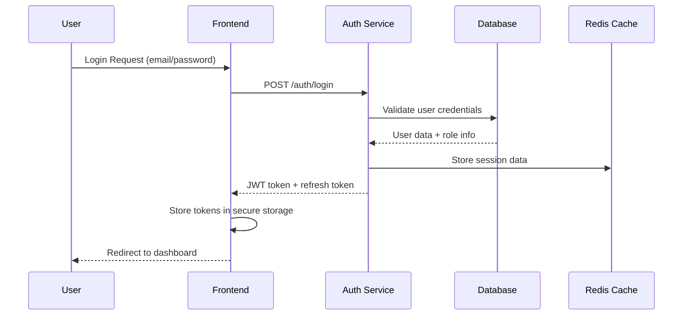
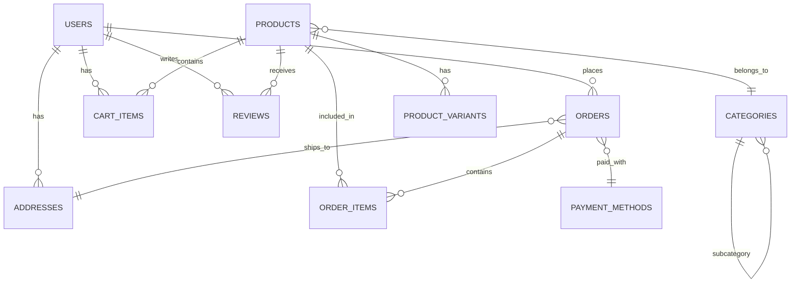

# Context

Provide comprehensive context and background information about specific parts of the codebase, project domain, business logic, or technical implementation details.

## Usage

```
/context [topic, component, or domain area]
```

**Examples:**
- `/context user authentication flow`
- `/context payment processing logic`
- `/context React component architecture`
- `/context database schema relationships`
- `/context API versioning strategy`

## What This Does

1. **Domain Context**: Explain business logic, user workflows, and domain-specific concepts
2. **Technical Context**: Detail system architecture, design patterns, and implementation approaches
3. **Code Context**: Analyze specific components, modules, or code sections
4. **Historical Context**: Provide background on technical decisions and evolution
5. **Integration Context**: Explain how different parts of the system interact

## Context Categories

### Business Domain Context
- **User Workflows**: End-to-end user journeys and business processes
- **Business Rules**: Logic governing system behavior and constraints
- **Domain Models**: Core entities and their relationships
- **Stakeholder Perspectives**: Different user types and their needs

### Technical Architecture Context
- **System Design**: High-level architecture and component relationships
- **Data Flow**: How information moves through the system
- **Integration Points**: External services and API interactions
- **Technology Stack**: Frameworks, libraries, and tools used

### Code Implementation Context
- **Component Structure**: How code is organized and modularized
- **Design Patterns**: Architectural patterns and conventions used
- **Dependencies**: Libraries, services, and internal module relationships
- **Configuration**: Environment settings and deployment considerations

### Historical Context
- **Decision History**: Why certain technical choices were made
- **Evolution Timeline**: How the system has changed over time
- **Legacy Considerations**: Older code patterns and migration paths
- **Lessons Learned**: Insights from previous implementations

## Context Analysis Process

1. **Scope Definition**
   - Identify the specific area requiring context
   - Determine the level of detail needed
   - Understand the purpose for requesting context
   - Define boundaries of the context scope

2. **Information Gathering**
   - Analyze relevant code, documentation, and specifications
   - Review git history and commit messages for historical context
   - Examine test cases and examples for usage patterns
   - Consult architectural diagrams and design documents

3. **Context Synthesis**
   - Organize information into logical structure
   - Highlight key concepts and relationships
   - Identify critical implementation details
   - Note important constraints and considerations

4. **Practical Application**
   - Provide actionable insights for current development work
   - Suggest best practices and common patterns
   - Identify potential pitfalls or areas of complexity
   - Recommend resources for deeper understanding

## Example Context Analyses

### User Authentication Flow Context

**Input**: `/context user authentication flow and session management`

```markdown
## Context: User Authentication Flow and Session Management

### Business Domain Context

**User Authentication Workflow**:


**Business Rules and Constraints**:
1. **Password Security**: Minimum 8 characters, complexity requirements
2. **Session Duration**: 15-minute access tokens, 7-day refresh tokens
3. **Account Security**: Account lockout after 5 failed attempts
4. **Multi-device Support**: Users can be logged in on up to 3 devices
5. **Role-based Access**: Admin, User, and Guest permission levels

**User Types and Authentication Needs**:
- **End Users**: Simple email/password login with "remember me" option
- **Admin Users**: Enhanced security with potential 2FA requirement
- **API Clients**: Service-to-service authentication using API keys
- **Mobile Apps**: OAuth-style authentication with longer-lived sessions

### Technical Architecture Context

**System Components**:
```javascript
// High-level authentication architecture
const authenticationSystem = {
  frontend: {
    components: ['LoginForm', 'AuthProvider', 'ProtectedRoute'],
    storage: 'localStorage + httpOnly cookies',
    tokenManagement: 'Automatic refresh + expiry handling'
  },
  
  backend: {
    authService: 'Express.js middleware + JWT generation',
    userService: 'User CRUD + password management',
    sessionService: 'Redis-based session tracking'
  },
  
  infrastructure: {
    database: 'PostgreSQL - user data + audit logs',
    cache: 'Redis - session storage + rate limiting',
    monitoring: 'Auth metrics + security events'
  }
};
```

**Authentication Flow Architecture**:

1. **Token-based Authentication (JWT)**
   - **Access Tokens**: Short-lived (15 min), contain user ID + permissions
   - **Refresh Tokens**: Long-lived (7 days), stored securely for token renewal
   - **Token Storage**: httpOnly cookies for web, secure storage for mobile

2. **Session Management**
   - **Redis Storage**: Session data cached for fast lookup
   - **Session Tracking**: Device fingerprinting + IP monitoring
   - **Logout Handling**: Token blacklisting + session cleanup

3. **Security Layers**
   - **Rate Limiting**: 5 login attempts per minute per IP
   - **CSRF Protection**: SameSite cookies + CSRF tokens
   - **XSS Prevention**: Content Security Policy + input sanitization

### Code Implementation Context

**Core Authentication Components**:

```javascript
// Authentication Service (Backend)
class AuthService {
  constructor(userService, sessionService, tokenService) {
    this.userService = userService;
    this.sessionService = sessionService;
    this.tokenService = tokenService;
  }

  async authenticateUser(email, password, deviceInfo) {
    try {
      // 1. Validate credentials
      const user = await this.userService.validateCredentials(email, password);
      if (!user) {
        throw new AuthenticationError('Invalid credentials');
      }

      // 2. Check account status
      if (user.isLocked || !user.isActive) {
        throw new AuthenticationError('Account not accessible');
      }

      // 3. Create session
      const session = await this.sessionService.createSession(user.id, deviceInfo);

      // 4. Generate tokens
      const accessToken = this.tokenService.generateAccessToken({
        userId: user.id,
        email: user.email,
        role: user.role,
        sessionId: session.id
      });

      const refreshToken = this.tokenService.generateRefreshToken({
        userId: user.id,
        sessionId: session.id
      });

      // 5. Log authentication event
      await this.auditService.logAuthEvent('LOGIN_SUCCESS', user.id, deviceInfo);

      return {
        user: this.sanitizeUserData(user),
        accessToken,
        refreshToken,
        expiresIn: 15 * 60 // 15 minutes
      };

    } catch (error) {
      await this.auditService.logAuthEvent('LOGIN_FAILURE', email, deviceInfo, error);
      throw error;
    }
  }

  // Token refresh flow
  async refreshToken(refreshToken, deviceInfo) {
    const decoded = this.tokenService.verifyRefreshToken(refreshToken);
    const session = await this.sessionService.getSession(decoded.sessionId);
    
    if (!session || session.isExpired()) {
      throw new AuthenticationError('Invalid session');
    }

    // Generate new access token
    const newAccessToken = this.tokenService.generateAccessToken({
      userId: session.userId,
      email: session.userEmail,
      role: session.userRole,
      sessionId: session.id
    });

    return { accessToken: newAccessToken, expiresIn: 15 * 60 };
  }
}
```

```javascript
// React Authentication Context (Frontend)
const AuthContext = createContext();

export const AuthProvider = ({ children }) => {
  const [user, setUser] = useState(null);
  const [loading, setLoading] = useState(true);
  const [tokens, setTokens] = useState({
    accessToken: null,
    refreshToken: null
  });

  // Automatic token refresh logic
  useEffect(() => {
    const refreshInterval = setInterval(async () => {
      if (tokens.refreshToken) {
        try {
          const response = await authAPI.refreshToken(tokens.refreshToken);
          setTokens(prev => ({
            ...prev,
            accessToken: response.accessToken
          }));
        } catch (error) {
          // Refresh failed, logout user
          await logout();
        }
      }
    }, 14 * 60 * 1000); // Refresh every 14 minutes

    return () => clearInterval(refreshInterval);
  }, [tokens.refreshToken]);

  const login = async (email, password, rememberMe = false) => {
    try {
      setLoading(true);
      const response = await authAPI.login(email, password);
      
      setUser(response.user);
      setTokens({
        accessToken: response.accessToken,
        refreshToken: response.refreshToken
      });

      // Configure axios default headers
      axios.defaults.headers.common['Authorization'] = `Bearer ${response.accessToken}`;

      // Store refresh token if "remember me" is checked
      if (rememberMe) {
        secureStorage.setItem('refreshToken', response.refreshToken);
      }

    } catch (error) {
      throw new Error(error.response?.data?.message || 'Login failed');
    } finally {
      setLoading(false);
    }
  };

  return (
    <AuthContext.Provider value={{ user, login, logout, loading }}>
      {children}
    </AuthContext.Provider>
  );
};
```

**Route Protection Implementation**:
```javascript
// Protected Route Component
const ProtectedRoute = ({ children, requiredRole = null }) => {
  const { user, loading } = useAuth();
  const location = useLocation();

  if (loading) {
    return <LoadingSpinner />;
  }

  if (!user) {
    // Redirect to login with return URL
    return <Navigate to="/login" state={{ from: location }} replace />;
  }

  if (requiredRole && !hasRole(user, requiredRole)) {
    return <AccessDenied requiredRole={requiredRole} userRole={user.role} />;
  }

  return children;
};

// Usage in routing
const AppRouter = () => (
  <Routes>
    <Route path="/login" element={<LoginPage />} />
    <Route path="/dashboard" element={
      <ProtectedRoute>
        <DashboardPage />
      </ProtectedRoute>
    } />
    <Route path="/admin" element={
      <ProtectedRoute requiredRole="admin">
        <AdminPage />
      </ProtectedRoute>
    } />
  </Routes>
);
```

### Database Schema Context

**User Authentication Tables**:
```sql
-- Users table - core user information
CREATE TABLE users (
  id UUID PRIMARY KEY DEFAULT gen_random_uuid(),
  email VARCHAR(255) UNIQUE NOT NULL,
  password_hash VARCHAR(255) NOT NULL,
  role VARCHAR(50) DEFAULT 'user',
  is_active BOOLEAN DEFAULT true,
  is_email_verified BOOLEAN DEFAULT false,
  failed_login_attempts INTEGER DEFAULT 0,
  locked_until TIMESTAMP NULL,
  created_at TIMESTAMP DEFAULT CURRENT_TIMESTAMP,
  updated_at TIMESTAMP DEFAULT CURRENT_TIMESTAMP
);

-- Sessions table - active user sessions
CREATE TABLE sessions (
  id UUID PRIMARY KEY DEFAULT gen_random_uuid(),
  user_id UUID REFERENCES users(id) ON DELETE CASCADE,
  device_fingerprint VARCHAR(255),
  ip_address INET,
  user_agent TEXT,
  created_at TIMESTAMP DEFAULT CURRENT_TIMESTAMP,
  last_activity TIMESTAMP DEFAULT CURRENT_TIMESTAMP,
  expires_at TIMESTAMP NOT NULL,
  is_active BOOLEAN DEFAULT true
);

-- Audit log for security events
CREATE TABLE auth_audit (
  id SERIAL PRIMARY KEY,
  user_id UUID REFERENCES users(id),
  event_type VARCHAR(50) NOT NULL,
  ip_address INET,
  user_agent TEXT,
  success BOOLEAN NOT NULL,
  details JSONB,
  created_at TIMESTAMP DEFAULT CURRENT_TIMESTAMP
);
```

**Key Relationships**:
- **Users → Sessions**: One-to-many (user can have multiple active sessions)
- **Users → Auth Audit**: One-to-many (all auth events tracked per user)
- **Sessions**: Self-contained session data with expiry tracking

### Historical Context and Evolution

**Version 1.0 (Initial Implementation)**:
- Simple username/password with server-side sessions
- Session stored in application memory (not scalable)
- Basic role checking without granular permissions

**Version 2.0 (JWT Migration)**:
- Migrated to JWT tokens for stateless authentication
- Introduced refresh token rotation for security
- Added Redis for session management and rate limiting

**Version 3.0 (Current)**:
- Enhanced security with device fingerprinting
- Comprehensive audit logging for compliance
- Support for multiple concurrent sessions per user

**Key Technical Decisions**:

1. **JWT vs. Session Cookies**: Chose JWT for scalability and API compatibility
   - **Pros**: Stateless, works across microservices, mobile-friendly
   - **Cons**: Token size, revocation complexity
   - **Solution**: Hybrid approach with Redis session tracking

2. **Password Hashing**: bcrypt with cost factor 12
   - **Reasoning**: Balance between security and performance
   - **Performance**: ~250ms hashing time acceptable for login flow
   - **Security**: Resistant to rainbow table and brute force attacks

3. **Token Storage Strategy**: httpOnly cookies for web, secure storage for mobile
   - **Web**: Automatic XSS protection, CSRF tokens for additional security
   - **Mobile**: Platform-specific secure storage (Keychain/Keystore)
   - **API Clients**: Bearer tokens in Authorization header

### Security Considerations

**Current Security Measures**:
- **Password Security**: bcrypt hashing, complexity requirements
- **Session Security**: Device fingerprinting, IP monitoring, expiry tracking
- **Token Security**: Short-lived access tokens, secure refresh token rotation
- **Rate Limiting**: Login attempt limiting, API rate limiting
- **Audit Trail**: Comprehensive logging of all authentication events

**Known Security Considerations**:
- **Token Revocation**: Immediate token invalidation requires Redis lookup
- **Device Fingerprinting**: Not foolproof, can be bypassed with effort
- **Cross-site Attacks**: CSRF protection relies on SameSite cookies + tokens
- **Social Engineering**: No technical solution for password sharing/phishing

**Future Security Enhancements**:
- **Two-Factor Authentication**: TOTP or SMS-based 2FA for admin accounts
- **Biometric Authentication**: Fingerprint/FaceID for mobile apps
- **Behavioral Analysis**: Unusual login pattern detection
- **Zero Trust Architecture**: Enhanced device verification and trust scoring

### Integration Points

**Frontend Integration**:
- **React Context**: Centralized authentication state management
- **Route Guards**: Automatic redirection for unauthenticated users
- **API Client**: Automatic token attachment and refresh handling
- **Error Handling**: Graceful handling of authentication errors

**Backend Integration**:
- **Express Middleware**: Authentication verification for all protected routes
- **Database Integration**: User lookup and session management
- **External Services**: API key authentication for service-to-service calls
- **Monitoring Integration**: Authentication metrics and alerting

**Third-party Integrations**:
- **Email Service**: Password reset and verification emails
- **Monitoring Tools**: Authentication event tracking and analysis
- **Security Tools**: Integration with security scanning and monitoring
- **Analytics**: User authentication behavior and conversion tracking

### Performance Considerations

**Current Performance Metrics**:
- **Login Response Time**: ~200ms average (including database lookup)
- **Token Verification**: ~5ms average (JWT validation only)
- **Session Lookup**: ~10ms average (Redis cache hit)
- **Password Hashing**: ~250ms (bcrypt cost factor 12)

**Optimization Strategies**:
- **Redis Caching**: Session data and user permissions cached for fast lookup
- **Connection Pooling**: Database connection reuse for reduced latency
- **JWT Optimization**: Minimal payload size, efficient signing algorithm
- **Async Processing**: Password hashing and audit logging handled asynchronously

**Scalability Considerations**:
- **Horizontal Scaling**: Stateless JWT tokens support multiple server instances
- **Database Scaling**: Read replicas for authentication queries
- **Cache Scaling**: Redis clustering for session storage at scale
- **CDN Integration**: Static authentication assets served from CDN

### Troubleshooting Common Issues

**Login Failures**:
1. **Check credentials**: Verify email/password combination
2. **Account status**: Confirm account is active and not locked
3. **Rate limiting**: Check if IP is rate limited
4. **Database connectivity**: Verify database connection and query performance

**Token Issues**:
1. **Expired tokens**: Implement automatic refresh flow
2. **Invalid signatures**: Check JWT signing key configuration
3. **Token blacklisting**: Verify Redis connectivity for blacklist checks
4. **Clock synchronization**: Ensure server time accuracy for token expiry

**Session Problems**:
1. **Redis connectivity**: Check Redis server status and connectivity
2. **Session expiry**: Verify session timeout configuration
3. **Device fingerprinting**: Handle cases where fingerprint changes
4. **Concurrent sessions**: Check session limit enforcement

### Development Guidelines

**Authentication Best Practices**:
- Always hash passwords using bcrypt or similar
- Use secure, httpOnly cookies for token storage in web applications
- Implement proper CSRF protection for state-changing operations
- Log all authentication events for security auditing
- Use rate limiting to prevent brute force attacks

**Code Review Checklist**:
- [ ] Sensitive data not logged or exposed in responses
- [ ] Proper input validation on all authentication endpoints
- [ ] Error messages don't reveal user existence (timing attacks)
- [ ] Session management follows security best practices
- [ ] Password policies enforced consistently

**Testing Strategies**:
- Unit tests for authentication service methods
- Integration tests for complete authentication flows
- Security tests for common vulnerabilities
- Performance tests for authentication under load
- End-to-end tests for user authentication journeys
```

### Database Schema Relationships Context

**Input**: `/context database schema relationships for e-commerce system`

```markdown
## Context: E-commerce Database Schema Relationships

### Domain Model Overview

**Core Business Entities**:


**Business Rules Encoded in Schema**:
1. **User-Order Relationship**: Users can place multiple orders, orders belong to one user
2. **Product Categorization**: Products belong to exactly one category, categories can have subcategories
3. **Order Composition**: Orders contain multiple items, items reference specific products
4. **Inventory Management**: Product variants track stock levels and pricing separately
5. **Review System**: Users can review products they've purchased, one review per product per user

### Database Schema Implementation

**Core Tables with Relationships**:

```sql
-- Users table - Customer and admin accounts
CREATE TABLE users (
  id UUID PRIMARY KEY DEFAULT gen_random_uuid(),
  email VARCHAR(255) UNIQUE NOT NULL,
  password_hash VARCHAR(255) NOT NULL,
  first_name VARCHAR(100) NOT NULL,
  last_name VARCHAR(100) NOT NULL,
  role VARCHAR(20) DEFAULT 'customer',
  is_active BOOLEAN DEFAULT true,
  email_verified_at TIMESTAMP NULL,
  created_at TIMESTAMP DEFAULT CURRENT_TIMESTAMP,
  updated_at TIMESTAMP DEFAULT CURRENT_TIMESTAMP
);

-- Categories table - Product organization (supports hierarchical categories)
CREATE TABLE categories (
  id SERIAL PRIMARY KEY,
  name VARCHAR(100) NOT NULL,
  slug VARCHAR(100) UNIQUE NOT NULL,
  description TEXT,
  parent_category_id INTEGER REFERENCES categories(id),
  sort_order INTEGER DEFAULT 0,
  is_active BOOLEAN DEFAULT true,
  created_at TIMESTAMP DEFAULT CURRENT_TIMESTAMP
);

-- Products table - Main product information
CREATE TABLE products (
  id UUID PRIMARY KEY DEFAULT gen_random_uuid(),
  name VARCHAR(200) NOT NULL,
  slug VARCHAR(200) UNIQUE NOT NULL,
  description TEXT,
  short_description VARCHAR(500),
  category_id INTEGER NOT NULL REFERENCES categories(id),
  base_price DECIMAL(10,2) NOT NULL,
  sku VARCHAR(100) UNIQUE NOT NULL,
  weight DECIMAL(8,3),
  dimensions JSONB, -- {length, width, height}
  is_active BOOLEAN DEFAULT true,
  created_at TIMESTAMP DEFAULT CURRENT_TIMESTAMP,
  updated_at TIMESTAMP DEFAULT CURRENT_TIMESTAMP
);

-- Product variants - Size, color, etc. variations
CREATE TABLE product_variants (
  id UUID PRIMARY KEY DEFAULT gen_random_uuid(),
  product_id UUID NOT NULL REFERENCES products(id) ON DELETE CASCADE,
  name VARCHAR(100) NOT NULL, -- e.g., "Large Red"
  sku VARCHAR(100) UNIQUE NOT NULL,
  price DECIMAL(10,2), -- Override base price if needed
  stock_quantity INTEGER NOT NULL DEFAULT 0,
  attributes JSONB, -- {size: "L", color: "red"}
  is_active BOOLEAN DEFAULT true,
  created_at TIMESTAMP DEFAULT CURRENT_TIMESTAMP
);

-- User addresses - Shipping and billing addresses
CREATE TABLE addresses (
  id UUID PRIMARY KEY DEFAULT gen_random_uuid(),
  user_id UUID NOT NULL REFERENCES users(id) ON DELETE CASCADE,
  type VARCHAR(20) NOT NULL, -- 'shipping' or 'billing'
  first_name VARCHAR(100) NOT NULL,
  last_name VARCHAR(100) NOT NULL,
  company VARCHAR(100),
  address_line1 VARCHAR(200) NOT NULL,
  address_line2 VARCHAR(200),
  city VARCHAR(100) NOT NULL,
  state VARCHAR(100) NOT NULL,
  postal_code VARCHAR(20) NOT NULL,
  country VARCHAR(2) NOT NULL, -- ISO country code
  phone VARCHAR(20),
  is_default BOOLEAN DEFAULT false,
  created_at TIMESTAMP DEFAULT CURRENT_TIMESTAMP
);

-- Orders table - Customer orders
CREATE TABLE orders (
  id UUID PRIMARY KEY DEFAULT gen_random_uuid(),
  user_id UUID NOT NULL REFERENCES users(id),
  order_number VARCHAR(20) UNIQUE NOT NULL,
  status VARCHAR(20) NOT NULL DEFAULT 'pending',
  subtotal DECIMAL(10,2) NOT NULL,
  tax_amount DECIMAL(10,2) NOT NULL DEFAULT 0,
  shipping_amount DECIMAL(10,2) NOT NULL DEFAULT 0,
  total_amount DECIMAL(10,2) NOT NULL,
  currency VARCHAR(3) DEFAULT 'USD',
  shipping_address_id UUID REFERENCES addresses(id),
  billing_address_id UUID REFERENCES addresses(id),
  notes TEXT,
  ordered_at TIMESTAMP DEFAULT CURRENT_TIMESTAMP,
  shipped_at TIMESTAMP NULL,
  delivered_at TIMESTAMP NULL
);

-- Order items - Products included in each order
CREATE TABLE order_items (
  id UUID PRIMARY KEY DEFAULT gen_random_uuid(),
  order_id UUID NOT NULL REFERENCES orders(id) ON DELETE CASCADE,
  product_id UUID NOT NULL REFERENCES products(id),
  product_variant_id UUID REFERENCES product_variants(id),
  quantity INTEGER NOT NULL CHECK (quantity > 0),
  unit_price DECIMAL(10,2) NOT NULL,
  total_price DECIMAL(10,2) NOT NULL,
  product_snapshot JSONB, -- Store product details at time of order
  created_at TIMESTAMP DEFAULT CURRENT_TIMESTAMP
);

-- Shopping cart items - Temporary product selections
CREATE TABLE cart_items (
  id UUID PRIMARY KEY DEFAULT gen_random_uuid(),
  user_id UUID NOT NULL REFERENCES users(id) ON DELETE CASCADE,
  product_id UUID NOT NULL REFERENCES products(id) ON DELETE CASCADE,
  product_variant_id UUID REFERENCES product_variants(id) ON DELETE CASCADE,
  quantity INTEGER NOT NULL CHECK (quantity > 0),
  created_at TIMESTAMP DEFAULT CURRENT_TIMESTAMP,
  updated_at TIMESTAMP DEFAULT CURRENT_TIMESTAMP,
  
  UNIQUE(user_id, product_id, product_variant_id)
);

-- Product reviews - Customer feedback
CREATE TABLE reviews (
  id UUID PRIMARY KEY DEFAULT gen_random_uuid(),
  product_id UUID NOT NULL REFERENCES products(id) ON DELETE CASCADE,
  user_id UUID NOT NULL REFERENCES users(id) ON DELETE CASCADE,
  order_id UUID REFERENCES orders(id), -- Optional: link to purchase
  rating INTEGER NOT NULL CHECK (rating >= 1 AND rating <= 5),
  title VARCHAR(200),
  content TEXT,
  is_verified_purchase BOOLEAN DEFAULT false,
  is_approved BOOLEAN DEFAULT false,
  created_at TIMESTAMP DEFAULT CURRENT_TIMESTAMP,
  
  UNIQUE(product_id, user_id) -- One review per product per user
);
```

### Key Relationship Patterns

**1. Hierarchical Relationships (Categories)**:
```sql
-- Self-referencing foreign key for category hierarchy
ALTER TABLE categories ADD CONSTRAINT categories_parent_fk 
FOREIGN KEY (parent_category_id) REFERENCES categories(id);

-- Query for category tree
WITH RECURSIVE category_tree AS (
  -- Root categories
  SELECT id, name, parent_category_id, 0 as level
  FROM categories 
  WHERE parent_category_id IS NULL
  
  UNION ALL
  
  -- Recursive part
  SELECT c.id, c.name, c.parent_category_id, ct.level + 1
  FROM categories c
  JOIN category_tree ct ON c.parent_category_id = ct.id
)
SELECT * FROM category_tree ORDER BY level, name;
```

**2. Order Composition Pattern**:
```sql
-- Orders contain multiple items with referential integrity
-- Cascade deletion ensures order items are removed with orders
-- Product snapshots preserve historical data even if products change

-- Calculate order totals
SELECT 
  o.id,
  o.order_number,
  SUM(oi.total_price) as items_total,
  o.tax_amount,
  o.shipping_amount,
  o.total_amount
FROM orders o
JOIN order_items oi ON o.id = oi.order_id
GROUP BY o.id, o.order_number, o.tax_amount, o.shipping_amount, o.total_amount;
```

**3. Inventory Management Pattern**:
```sql
-- Product variants allow for complex inventory tracking
-- Each variant has its own stock and pricing

-- Check product availability
SELECT 
  p.name,
  pv.name as variant_name,
  pv.stock_quantity,
  CASE 
    WHEN pv.stock_quantity > 0 THEN 'In Stock'
    ELSE 'Out of Stock'
  END as availability_status
FROM products p
LEFT JOIN product_variants pv ON p.id = pv.product_id
WHERE p.id = $1 AND p.is_active = true;
```

**4. User Data Aggregation Pattern**:
```sql
-- Multiple addresses per user with type classification
-- Default address handling for UX optimization

-- Get user's default addresses
SELECT 
  u.id,
  u.email,
  shipping.address_line1 as shipping_address,
  billing.address_line1 as billing_address
FROM users u
LEFT JOIN addresses shipping ON u.id = shipping.user_id 
  AND shipping.type = 'shipping' 
  AND shipping.is_default = true
LEFT JOIN addresses billing ON u.id = billing.user_id 
  AND billing.type = 'billing' 
  AND billing.is_default = true
WHERE u.id = $1;
```

### Performance Optimization Context

**Indexing Strategy**:
```sql
-- Primary access patterns optimized with indexes
CREATE INDEX idx_products_category_active ON products(category_id, is_active);
CREATE INDEX idx_products_search ON products USING gin(to_tsvector('english', name || ' ' || description));
CREATE INDEX idx_orders_user_status ON orders(user_id, status);
CREATE INDEX idx_orders_date_range ON orders(ordered_at) WHERE ordered_at >= '2024-01-01';
CREATE INDEX idx_cart_items_user ON cart_items(user_id, updated_at);
CREATE INDEX idx_reviews_product_approved ON reviews(product_id, is_approved);

-- Composite indexes for common query patterns
CREATE INDEX idx_order_items_order_product ON order_items(order_id, product_id);
CREATE INDEX idx_product_variants_product_active ON product_variants(product_id, is_active);
```

**Query Optimization Examples**:
```sql
-- Optimized product search with category filtering
EXPLAIN ANALYZE
SELECT 
  p.id, p.name, p.base_price, c.name as category_name,
  AVG(r.rating) as avg_rating,
  COUNT(r.id) as review_count
FROM products p
JOIN categories c ON p.category_id = c.id
LEFT JOIN reviews r ON p.id = r.product_id AND r.is_approved = true
WHERE 
  p.is_active = true 
  AND c.is_active = true
  AND p.search_vector @@ plainto_tsquery('smartphone')
GROUP BY p.id, p.name, p.base_price, c.name
ORDER BY avg_rating DESC NULLS LAST, review_count DESC
LIMIT 20;
```

### Data Integrity and Constraints

**Business Logic Constraints**:
```sql
-- Ensure order totals are calculated correctly
ALTER TABLE orders ADD CONSTRAINT orders_total_check 
CHECK (total_amount = subtotal + tax_amount + shipping_amount);

-- Prevent negative inventory
ALTER TABLE product_variants ADD CONSTRAINT variants_stock_positive 
CHECK (stock_quantity >= 0);

-- Ensure review ratings are within valid range
ALTER TABLE reviews ADD CONSTRAINT reviews_rating_range 
CHECK (rating >= 1 AND rating <= 5);

-- Ensure cart quantities are positive
ALTER TABLE cart_items ADD CONSTRAINT cart_quantity_positive 
CHECK (quantity > 0);
```

**Referential Integrity Patterns**:
```sql
-- Cascade deletions for dependent data
-- ON DELETE CASCADE: cart_items, order_items (with orders)
-- ON DELETE SET NULL: Not used in this schema
-- ON DELETE RESTRICT: Default behavior prevents accidental deletions

-- Example: Deleting a user cleans up their data
-- This will cascade to: cart_items, addresses, reviews
-- But orders are preserved (business requirement)
```

### Common Query Patterns

**Product Catalog Queries**:
```sql
-- Featured products with reviews and inventory
SELECT 
  p.*,
  c.name as category_name,
  AVG(r.rating) as avg_rating,
  COUNT(r.id) as review_count,
  MIN(pv.price) as min_price,
  MAX(pv.price) as max_price,
  SUM(pv.stock_quantity) as total_stock
FROM products p
JOIN categories c ON p.category_id = c.id
LEFT JOIN reviews r ON p.id = r.product_id AND r.is_approved = true
LEFT JOIN product_variants pv ON p.id = pv.product_id AND pv.is_active = true
WHERE p.is_active = true AND c.is_active = true
GROUP BY p.id, c.name
HAVING SUM(pv.stock_quantity) > 0  -- Only in-stock products
ORDER BY avg_rating DESC NULLS LAST
LIMIT 12;
```

**User Order History**:
```sql
-- Complete order history with items
SELECT 
  o.id,
  o.order_number,
  o.status,
  o.total_amount,
  o.ordered_at,
  json_agg(
    json_build_object(
      'product_name', p.name,
      'variant_name', pv.name,
      'quantity', oi.quantity,
      'unit_price', oi.unit_price
    )
  ) as items
FROM orders o
JOIN order_items oi ON o.id = oi.order_id
JOIN products p ON oi.product_id = p.id
LEFT JOIN product_variants pv ON oi.product_variant_id = pv.id
WHERE o.user_id = $1
GROUP BY o.id, o.order_number, o.status, o.total_amount, o.ordered_at
ORDER BY o.ordered_at DESC;
```

**Shopping Cart Management**:
```sql
-- Current cart with product details
SELECT 
  ci.id,
  ci.quantity,
  p.name as product_name,
  p.base_price,
  pv.name as variant_name,
  COALESCE(pv.price, p.base_price) as current_price,
  pv.stock_quantity,
  ci.quantity * COALESCE(pv.price, p.base_price) as line_total
FROM cart_items ci
JOIN products p ON ci.product_id = p.id
LEFT JOIN product_variants pv ON ci.product_variant_id = pv.id
WHERE ci.user_id = $1 AND p.is_active = true
ORDER BY ci.updated_at DESC;
```

### Data Migration and Evolution Context

**Schema Versioning Strategy**:
```sql
-- Migration example: Adding product search optimization
-- Migration: 202401150001_add_product_search_vector.sql

-- Add search vector column
ALTER TABLE products ADD COLUMN search_vector tsvector;

-- Populate search vector
UPDATE products 
SET search_vector = to_tsvector('english', name || ' ' || COALESCE(description, ''));

-- Add index for fast full-text search
CREATE INDEX idx_products_search_vector ON products USING gin(search_vector);

-- Add trigger to keep search vector updated
CREATE OR REPLACE FUNCTION update_product_search_vector()
RETURNS trigger AS $$
BEGIN
  NEW.search_vector = to_tsvector('english', NEW.name || ' ' || COALESCE(NEW.description, ''));
  RETURN NEW;
END;
$$ LANGUAGE plpgsql;

CREATE TRIGGER products_search_vector_update
  BEFORE INSERT OR UPDATE ON products
  FOR EACH ROW EXECUTE FUNCTION update_product_search_vector();
```

**Data Archival Strategy**:
```sql
-- Archive old orders (older than 2 years)
CREATE TABLE orders_archive (LIKE orders INCLUDING ALL);
CREATE TABLE order_items_archive (LIKE order_items INCLUDING ALL);

-- Move old data to archive tables
WITH archived_orders AS (
  DELETE FROM orders 
  WHERE ordered_at < NOW() - INTERVAL '2 years'
  RETURNING *
)
INSERT INTO orders_archive SELECT * FROM archived_orders;
```

This schema design balances normalization with performance, providing a solid foundation for an e-commerce system while maintaining data integrity and supporting complex business requirements.
```

## Context Delivery Best Practices

### Information Organization
- **Structured Layout**: Use consistent headings and sections for easy navigation
- **Visual Aids**: Include diagrams, code examples, and data flow illustrations
- **Actionable Insights**: Provide practical information that can be immediately applied
- **Cross-references**: Link related concepts and components

### Technical Detail Balance
- **High-level Overview**: Start with architectural or domain overview
- **Implementation Details**: Provide specific code examples and configurations
- **Historical Context**: Explain evolution and decision rationale
- **Future Considerations**: Note areas for potential improvement or change

### Context Validation
- **Accuracy**: Verify all technical details and code examples
- **Completeness**: Cover all major aspects of the requested context
- **Relevance**: Focus on information directly applicable to current development work
- **Timeliness**: Ensure context reflects current system state and best practices

## Follow-up Actions

Based on provided context:
- `/explain [concept]` - Get deeper explanation of specific concepts mentioned
- `/analyze-code [component]` - Detailed analysis of specific code components
- `/best-practice` - Establish best practices based on context insights
- `/generate-documentation` - Create formal documentation from context information