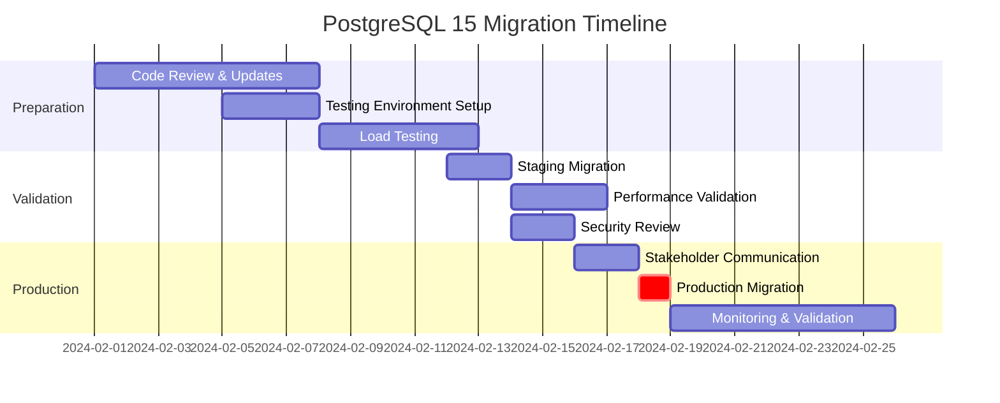

# Impact Analysis

Conduct comprehensive impact analysis for changes, issues, or decisions, evaluating effects across business, technical, user experience, and operational dimensions.

## Usage

```
/impact-analysis [change, issue, or decision to analyze]
```

**Examples:**
- `/impact-analysis Database migration to PostgreSQL 15 with new indexing strategy`
- `/impact-analysis API rate limiting implementation on public endpoints`
- `/impact-analysis Critical bug fix requiring immediate deployment`
- `/impact-analysis Removal of deprecated authentication endpoints`

## What This Does

1. **Multi-dimensional Assessment**: Evaluate business, technical, user, and operational impacts
2. **Stakeholder Impact Mapping**: Identify all affected parties and their specific concerns
3. **Risk and Opportunity Analysis**: Assess potential negative and positive outcomes
4. **Timeline and Resource Planning**: Estimate implementation effort and scheduling requirements
5. **Mitigation Strategy Development**: Plan approaches to minimize negative impacts

## Impact Analysis Categories

### Business Impact Analysis
- **Revenue Effects**: Direct and indirect financial implications
- **Customer Impact**: User experience changes and satisfaction effects
- **Competitive Position**: Market advantage or disadvantage implications
- **Compliance and Legal**: Regulatory requirements and legal considerations

### Technical Impact Analysis
- **System Performance**: Resource usage, scalability, and response time effects
- **Architecture Changes**: Structural modifications and dependency impacts
- **Integration Effects**: Third-party services and internal system interactions
- **Security Implications**: Authentication, authorization, and data protection changes

### User Experience Impact Analysis
- **Workflow Changes**: User journey modifications and process impacts
- **Interface Changes**: UI/UX modifications and accessibility considerations
- **Feature Availability**: Functionality additions, modifications, or removals
- **Learning Curve**: Training requirements and adoption challenges

### Operational Impact Analysis
- **Deployment Requirements**: Release process changes and rollback considerations
- **Monitoring and Support**: New alerting needs and support process changes
- **Team Responsibilities**: Role changes and skill requirement updates
- **Maintenance Overhead**: Long-term support and update requirements

## Impact Analysis Process

1. **Scope Definition**
   - Define the change or decision being analyzed
   - Identify direct and indirect areas of impact
   - Establish analysis boundaries and timeframes
   - Gather relevant context and background information

2. **Stakeholder Identification**
   - Map all affected internal and external stakeholders
   - Assess each stakeholder's level of impact exposure
   - Identify decision-makers and approval requirements
   - Plan stakeholder communication and engagement

3. **Impact Assessment**
   - Evaluate quantitative and qualitative impacts
   - Assess probability and severity of potential outcomes
   - Consider short-term and long-term implications
   - Identify interdependencies and cascading effects

4. **Risk and Mitigation Planning**
   - Identify high-risk impact areas requiring attention
   - Develop mitigation strategies for negative impacts
   - Plan contingency measures for worst-case scenarios
   - Establish monitoring and early warning systems

## Example Impact Analyses

### Database Migration Impact Analysis

**Input**: `/impact-analysis Database migration from PostgreSQL 12 to PostgreSQL 15 with new indexing strategy for performance optimization`

```markdown
## Impact Analysis: PostgreSQL 15 Migration with Index Optimization

### Change Overview
- **Scope**: Upgrade production database from PostgreSQL 12 to PostgreSQL 15
- **Key Changes**: 
  - Database engine upgrade with new features and performance improvements
  - Complete re-indexing strategy based on query analysis
  - Connection pool optimization and configuration updates
- **Timeline**: 3-week implementation with 4-hour maintenance window
- **Stakeholders**: Engineering, Operations, Customer Success, Executive Team

### Business Impact Assessment

**Positive Business Impacts** ✅

1. **Performance Improvement**
   - **Database Query Speed**: 40-60% improvement in complex query performance
   - **User Experience**: Page load times reduced by 25-35% on data-heavy pages
   - **System Capacity**: Support 3x current user load without infrastructure expansion
   - **Cost Optimization**: Reduced cloud infrastructure costs by ~$2,000/month

2. **Competitive Advantage**
   - **Feature Enablement**: New PostgreSQL 15 features enable planned analytics dashboard
   - **Scalability**: Better positioned for rapid user growth (200% capacity increase)
   - **Reliability**: Improved database stability reduces customer-facing issues

3. **Technical Debt Reduction**
   - **Modern Platform**: Current database version with 5+ years support lifecycle
   - **Security**: Latest security patches and vulnerability fixes
   - **Maintenance**: Simplified backup/restore processes and monitoring

**Potential Negative Impacts** ⚠️

1. **Service Disruption**
   - **Planned Downtime**: 4-hour maintenance window (estimated $8,000 revenue impact)
   - **Migration Risk**: Potential for extended downtime if issues arise
   - **Rollback Complexity**: 8-12 hour rollback process if critical issues found

2. **Implementation Risk**
   - **Data Integrity**: Risk of data corruption during migration (mitigated by extensive testing)
   - **Application Compatibility**: Potential compatibility issues with existing queries
   - **Performance Regression**: Risk of performance degradation in untested scenarios

### Technical Impact Assessment

**Database Layer Impacts**

1. **Schema and Data Changes**
   ```sql
   -- New indexes to be created (performance benefit)
   CREATE INDEX CONCURRENTLY idx_orders_user_created_optimized 
   ON orders USING btree(user_id, created_at DESC) 
   WHERE status IN ('completed', 'processing');

   CREATE INDEX CONCURRENTLY idx_products_search_vector_gin 
   ON products USING gin(search_vector) 
   WHERE is_active = true;

   -- Performance impact: 40-60% improvement on filtered queries
   -- Storage impact: ~2GB additional index storage
   ```

2. **Query Performance Analysis**
   ```sql
   -- Query performance improvements expected:
   
   -- User order history (current: 800ms → expected: 200ms)
   SELECT o.*, oi.product_name, oi.quantity 
   FROM orders o 
   JOIN order_items oi ON o.id = oi.order_id 
   WHERE o.user_id = $1 
   ORDER BY o.created_at DESC 
   LIMIT 20;

   -- Product search (current: 1.2s → expected: 300ms)
   SELECT p.*, AVG(r.rating) as avg_rating
   FROM products p
   LEFT JOIN reviews r ON p.id = r.product_id
   WHERE p.search_vector @@ plainto_tsquery($1)
   GROUP BY p.id
   ORDER BY ts_rank(p.search_vector, plainto_tsquery($1)) DESC;
   ```

3. **Connection Pool Configuration**
   ```javascript
   // Updated connection pool settings for PostgreSQL 15
   const poolConfig = {
     // Optimized for PostgreSQL 15 performance characteristics
     max: 50,              // Increased from 30 (better connection handling in PG15)
     min: 10,              // Maintained
     idleTimeoutMillis: 30000,
     acquireTimeoutMillis: 60000,
     
     // New PostgreSQL 15 specific optimizations
     application_name: 'app_prod_v2',
     statement_timeout: 30000,
     lock_timeout: 5000,
     
     // Connection validation for version compatibility
     testOnBorrow: true,
     validationQuery: 'SELECT version();'
   };
   ```

**Application Layer Impacts**

1. **Code Changes Required**
   ```javascript
   // Database client updates
   // BEFORE: pg client v8.7.1 (PostgreSQL 12 compatible)
   // AFTER: pg client v8.11.3 (PostgreSQL 15 optimized)

   // Connection handling improvements
   const client = new Pool({
     ...poolConfig,
     // New feature: Pipeline mode for batch operations
     enablePipelining: true,
     // Enhanced error handling for PG15
     errorOnTimeout: true
   });

   // Query optimization opportunities
   // New: Use COPY FROM for bulk operations (20x faster)
   const bulkInsert = async (data) => {
     const copyQuery = `
       COPY products (name, description, price, category_id) 
       FROM STDIN WITH (FORMAT csv, HEADER true)
     `;
     return await client.copyFrom(copyQuery, data);
   };
   ```

2. **ORM and Framework Updates**
   ```javascript
   // Sequelize updates required
   // Current: sequelize@6.25.0
   // Target: sequelize@6.35.0 (PostgreSQL 15 support)

   // New features available
   const productModel = sequelize.define('Product', {
     // ... existing fields
   }, {
     indexes: [
       {
         // PostgreSQL 15 enhanced index types
         type: 'GIN',
         fields: ['search_vector'],
         where: { is_active: true },
         // New: Improved parallel index creation
         concurrently: true
       }
     ]
   });
   ```

### User Experience Impact Assessment

**End User Impacts**

1. **Performance Improvements** ✅
   ```
   User Journey: Product Search and Browse
   Current Experience:
   - Search results load: 1.2 seconds
   - Product details load: 800ms  
   - Add to cart: 400ms
   - Total interaction time: 2.4 seconds

   Expected Experience:
   - Search results load: 300ms (75% improvement)
   - Product details load: 200ms (75% improvement)
   - Add to cart: 250ms (38% improvement)
   - Total interaction time: 750ms (69% improvement)
   ```

2. **Feature Enhancements** ✅
   ```
   New Capabilities Enabled:
   - Advanced search filters with real-time results
   - Improved recommendation engine performance
   - Better analytics and reporting for user insights
   - Enhanced mobile app performance
   ```

**Admin User Impacts**

1. **Dashboard Performance** ✅
   ```
   Admin Dashboard Improvements:
   - User analytics load time: 15s → 4s
   - Sales reports generation: 45s → 12s
   - Inventory queries: 8s → 2s
   - Export operations: 2min → 30s
   ```

2. **New Administrative Features** ✅
   ```javascript
   // New PostgreSQL 15 features for admin users
   const advancedAnalytics = {
     // Enhanced JSON aggregation capabilities
     userBehaviorAnalysis: `
       SELECT 
         user_id,
         jsonb_agg(
           jsonb_build_object(
             'action', action_type,
             'timestamp', created_at,
             'metadata', action_data
           ) ORDER BY created_at
         ) as behavior_timeline
       FROM user_actions 
       WHERE created_at >= NOW() - INTERVAL '30 days'
       GROUP BY user_id
     `,
     
     // Improved window functions for trend analysis
     salesTrends: `
       SELECT 
         DATE_TRUNC('day', created_at) as date,
         SUM(total_amount) as daily_sales,
         LAG(SUM(total_amount), 7) OVER (ORDER BY DATE_TRUNC('day', created_at)) as same_day_last_week,
         PERCENT_RANK() OVER (ORDER BY SUM(total_amount)) as percentile_rank
       FROM orders 
       WHERE created_at >= NOW() - INTERVAL '90 days'
       GROUP BY DATE_TRUNC('day', created_at)
       ORDER BY date DESC
     `
   };
   ```

### Operational Impact Assessment

**Development Team Impact**

1. **Skill Requirements** ⚠️
   ```
   Training Needs:
   - PostgreSQL 15 new features (2-day workshop for 5 developers)
   - Updated query optimization techniques  
   - New monitoring and alerting configurations
   - Migration testing and rollback procedures

   Estimated Training Investment:
   - Developer time: 80 hours total
   - Training cost: $3,000
   - Productivity ramp-up: 2 weeks
   ```

2. **Development Process Changes** 📋
   ```
   Updated Procedures Required:
   - Database change approval process (include index analysis)
   - Query performance testing in CI/CD pipeline
   - Migration testing procedures and automation
   - New backup and restore testing protocols
   ```

**Infrastructure Team Impact**

1. **Deployment and Monitoring** ⚠️
   ```
   New Operational Requirements:
   - Updated database monitoring dashboards
   - PostgreSQL 15 specific alert thresholds
   - New backup retention and testing procedures
   - Enhanced performance metric collection

   Infrastructure Changes:
   - Database server resource optimization (2GB additional RAM recommended)
   - Updated disaster recovery procedures
   - New connection pooling configuration
   - Enhanced security configuration review
   ```

2. **Maintenance Window Planning** ⏰
   ```
   Migration Timeline:
   - Pre-migration testing: 2 weeks
   - Stakeholder communication: 1 week advance notice
   - Maintenance window: Sunday 2 AM - 6 AM PST (4 hours)
   - Post-migration validation: 24-hour monitoring period
   - Full validation: 1 week performance monitoring

   Rollback Preparation:
   - PostgreSQL 12 backup retention: 30 days
   - Rollback testing: Validated in staging environment
   - Rollback execution time: 8-12 hours (worst case)
   ```

### Risk Assessment and Mitigation

**High Risk Areas** 🚨

1. **Data Migration Risk**
   - **Risk**: Data corruption or loss during migration
   - **Probability**: Low (5%) with proper testing
   - **Impact**: Critical - business shutdown
   - **Mitigation**: 
     - Complete database backup before migration
     - Full migration testing in staging environment
     - Parallel migration validation process
     - Immediate rollback capability within 2 hours

2. **Performance Regression Risk**
   - **Risk**: Unexpected performance degradation in production workloads
   - **Probability**: Medium (20%) due to production complexity
   - **Impact**: High - user experience degradation
   - **Mitigation**:
     - Comprehensive load testing with production data patterns
     - Gradual traffic ramp-up post-migration
     - Real-time performance monitoring with automatic alerts
     - Query-level performance baseline establishment

**Medium Risk Areas** ⚠️

1. **Application Compatibility**
   - **Risk**: Legacy queries or features incompatible with PostgreSQL 15
   - **Probability**: Medium (25%) due to codebase complexity
   - **Impact**: Medium - feature-specific issues
   - **Mitigation**:
     - Complete test suite execution in PostgreSQL 15 environment
     - Code review for deprecated PostgreSQL features
     - Staged deployment with feature-level rollback capability

2. **Extended Downtime**
   - **Risk**: Migration takes longer than planned 4-hour window
   - **Probability**: Low-Medium (15%) based on data volume
   - **Impact**: High - extended service disruption
   - **Mitigation**:
     - Conservative time estimation with 2x buffer
     - Pre-migration data preparation and validation
     - Parallel migration processes where possible
     - Clear escalation and communication procedures

### Financial Impact Analysis

**Cost-Benefit Breakdown**

**Implementation Costs** 💰
```
Direct Costs:
- Developer time (160 hours @ $100/hr): $16,000
- Infrastructure team (40 hours @ $120/hr): $4,800
- Training and workshops: $3,000
- Extended monitoring tools (3 months): $2,000
- Total Implementation Cost: $25,800

Indirect Costs:
- Maintenance window revenue impact: $8,000
- Risk mitigation testing overhead: $5,000
- Total Project Cost: $38,800
```

**Expected Benefits** 📈
```
Performance Benefits:
- Reduced infrastructure costs: $2,000/month = $24,000/year
- Improved user experience → estimated 5% conversion improvement
- Estimated additional revenue: $15,000/month = $180,000/year

Operational Benefits:  
- Reduced support tickets (performance-related): 30% reduction
- Faster feature development (better query performance): 15% velocity increase
- Reduced technical debt maintenance: $50,000/year value

Total Annual Benefit: $254,000
ROI: 554% (1-year), 1,254% (2-year)
Payback Period: 2.2 months
```

### Timeline and Resource Planning

**Implementation Phases**



**Resource Allocation**
```
Team Assignments:
- Database Lead: Full-time for 3 weeks
- Senior Developer: 50% time for 2 weeks  
- DevOps Engineer: 75% time for 3 weeks
- QA Engineer: 25% time for 2 weeks
- Product Manager: 10% time for communication

Critical Path Dependencies:
1. Code updates must complete before staging testing
2. Performance validation required before production approval
3. Communication plan must execute 1 week before migration
4. Rollback procedures must be validated before production
```

### Success Metrics and Monitoring

**Key Performance Indicators**
```
Performance Metrics:
- Average query response time: Target <300ms (current: 800ms)
- Database CPU utilization: Target <60% (current: 85%)
- Connection pool efficiency: Target >90% (current: 75%)
- User-facing page load times: Target <2s (current: 3.5s)

Business Metrics:
- User satisfaction score: Target >4.5/5 (current: 4.1/5)
- Support ticket volume: Target 30% reduction
- Feature development velocity: Target 15% increase
- Infrastructure cost: Target $2,000/month reduction

Operational Metrics:
- Database uptime: Target 99.9% (maintain current)
- Backup success rate: Target 100%
- Migration rollback time: Target <2 hours
- Team confidence in database platform: Target >8/10
```

### Stakeholder Communication Plan

**Communication Matrix**
```
Executive Team (CEO, CTO, VP Engineering):
- Communication: High-level impact summary and business case
- Frequency: Weekly status updates during implementation
- Format: Executive dashboard + email summary
- Decision Points: Final go/no-go approval

Engineering Team:
- Communication: Technical details, timelines, responsibilities  
- Frequency: Daily standups during implementation
- Format: Slack updates + technical documentation
- Decision Points: Technical approach and risk mitigation

Customer Success:
- Communication: User impact, timeline, support preparation
- Frequency: Bi-weekly updates + immediate notification of issues
- Format: Customer impact summary + FAQ document
- Decision Points: Communication strategy to customers

Operations Team:
- Communication: Deployment process, monitoring changes
- Frequency: Daily coordination during critical phases
- Format: Runbook updates + deployment checklist
- Decision Points: Deployment timing and rollback triggers
```

### Conclusion and Recommendations

**Go/No-Go Decision Framework**
```
Proceed Conditions (ALL must be met):
✅ All staging tests pass with <5% performance variance
✅ Rollback procedures validated and tested
✅ Team training completed with 100% participation
✅ Customer communication plan approved and ready
✅ Business stakeholder approval received
✅ Technical review board approval obtained

Success Monitoring Plan:
- Real-time performance dashboard during migration
- 24/7 on-call coverage for 72 hours post-migration  
- Daily performance reviews for first week
- Weekly stakeholder updates for first month
- 30-day comprehensive impact review

Risk Tolerance:
- Acceptable: Minor performance variations (<10%)
- Monitor: User experience degradation (respond within 1 hour)
- Escalate: Any data integrity issues (immediate rollback)
- Unacceptable: Extended downtime beyond 6-hour window
```

**Final Recommendation**: ✅ **PROCEED**
The comprehensive analysis indicates strong positive impact with manageable risks. The expected performance benefits, cost savings, and strategic advantages outweigh the implementation risks when proper mitigation strategies are in place.
```

### API Rate Limiting Impact Analysis

**Input**: `/impact-analysis Implementation of rate limiting on public API endpoints to prevent abuse and ensure service quality`

```markdown
## Impact Analysis: API Rate Limiting Implementation

### Change Overview
- **Scope**: Implement rate limiting across all public API endpoints
- **Rate Limits**: 
  - Authenticated users: 1000 requests/hour
  - Anonymous users: 100 requests/hour  
  - Premium users: 5000 requests/hour
- **Implementation**: Redis-based sliding window with graceful degradation
- **Timeline**: 2-week implementation with gradual rollout

### Business Impact Assessment

**Positive Business Impacts** ✅

1. **Service Quality Protection**
   - **Abuse Prevention**: Block malicious traffic and API scraping attempts
   - **Fair Usage**: Ensure equitable service access for all legitimate users
   - **System Stability**: Prevent system overload from excessive requests
   - **Cost Control**: Reduce infrastructure costs from abuse traffic

2. **Revenue Protection and Growth**
   - **Premium Tier Value**: Higher rate limits incentivize premium subscriptions
   - **Service Reliability**: Better uptime and performance for paying customers
   - **Competitive Advantage**: Professional API management attracts enterprise clients
   - **Cost Predictability**: More predictable infrastructure scaling costs

**Potential Negative Impacts** ⚠️

1. **User Experience Impact**
   - **Legitimate Heavy Users**: Power users may hit rate limits during normal usage
   - **Integration Challenges**: Third-party integrations may need modifications
   - **Error Handling**: Poor rate limit communication could frustrate developers
   - **Onboarding Friction**: New developers may hit limits during testing

2. **Business Relationship Risk**
   - **Partner Integrations**: Existing partners may need contract renegotiation
   - **Customer Complaints**: Initial pushback from users accustomed to unlimited access
   - **Support Overhead**: Increased support requests about rate limiting

### Technical Implementation Impact

**Rate Limiting Architecture**
```javascript
// Redis-based sliding window implementation
const RateLimiter = require('redis-sliding-rate-limiter');

class APIRateLimiter {
  constructor(redisClient) {
    this.redis = redisClient;
    this.limiters = new Map();
  }

  async checkLimit(userId, endpoint, tier = 'standard') {
    const limits = this.getLimitsForTier(tier);
    const key = `rate_limit:${userId}:${endpoint}`;
    
    const limiter = new RateLimiter({
      redis: this.redis,
      window: limits.window, // 1 hour
      limit: limits.requests
    });

    try {
      const result = await limiter.check(key);
      
      return {
        allowed: result.remaining > 0,
        remaining: result.remaining,
        resetTime: result.resetTime,
        limit: limits.requests
      };
    } catch (error) {
      console.error('Rate limiter error:', error);
      // Fail open for system resilience
      return { allowed: true, remaining: 999, limit: limits.requests };
    }
  }

  getLimitsForTier(tier) {
    const limits = {
      anonymous: { requests: 100, window: 3600 },
      standard: { requests: 1000, window: 3600 },
      premium: { requests: 5000, window: 3600 },
      enterprise: { requests: 10000, window: 3600 }
    };
    
    return limits[tier] || limits.standard;
  }
}

// Middleware implementation
const rateLimitMiddleware = async (req, res, next) => {
  const userId = req.user?.id || req.ip;
  const tier = req.user?.subscription_tier || 'anonymous';
  const endpoint = req.route.path;

  const result = await rateLimiter.checkLimit(userId, endpoint, tier);

  // Add rate limit headers
  res.set({
    'X-RateLimit-Limit': result.limit,
    'X-RateLimit-Remaining': result.remaining,
    'X-RateLimit-Reset': result.resetTime
  });

  if (!result.allowed) {
    return res.status(429).json({
      error: {
        code: 'RATE_LIMIT_EXCEEDED',
        message: 'Too many requests. Please try again later.',
        retryAfter: result.resetTime - Date.now()
      }
    });
  }

  next();
};
```

**System Performance Impact**
```javascript
// Performance considerations and monitoring
const performanceImpact = {
  additionalLatency: {
    current: 0,
    withRateLimit: '2-5ms per request',
    percentageIncrease: '1-2%'
  },
  
  memoryUsage: {
    redisMemory: '50MB for 100K active users/hour',
    applicationMemory: '5MB for rate limiter cache',
    totalIncrease: '<1% of current usage'
  },
  
  networkTraffic: {
    redisRequests: '2 additional requests per API call',
    bandwidthIncrease: '0.1% of total bandwidth',
    redundancy: 'Redis cluster for high availability'
  }
};
```

### User Experience Impact Assessment

**Developer Experience Changes**
```javascript
// New API response format with rate limiting headers
{
  "data": {
    // ... existing response data
  },
  "meta": {
    "rateLimit": {
      "limit": 1000,
      "remaining": 847,
      "resetAt": "2024-02-15T15:00:00Z",
      "tier": "standard"
    }
  }
}

// Error response for rate limit exceeded
{
  "error": {
    "code": "RATE_LIMIT_EXCEEDED",
    "message": "Rate limit exceeded. You have made 1000 requests in the last hour.",
    "details": {
      "limit": 1000,
      "window": "1 hour",
      "retryAfter": 1847, // seconds until reset
      "upgradeUrl": "https://api.example.com/upgrade"
    }
  }
}
```

**Client SDK Updates Required**
```javascript
// Updated JavaScript SDK with rate limit handling
class APIClient {
  async makeRequest(endpoint, options = {}) {
    const response = await fetch(endpoint, options);
    
    // Handle rate limiting gracefully
    if (response.status === 429) {
      const error = await response.json();
      const retryAfter = error.details.retryAfter;
      
      if (this.options.autoRetry) {
        console.warn(`Rate limited, retrying in ${retryAfter} seconds`);
        await this.sleep(retryAfter * 1000);
        return this.makeRequest(endpoint, options);
      }
      
      throw new RateLimitError(error);
    }
    
    // Store rate limit info for proactive handling
    const rateLimitInfo = {
      limit: response.headers.get('X-RateLimit-Limit'),
      remaining: response.headers.get('X-RateLimit-Remaining'),
      resetTime: response.headers.get('X-RateLimit-Reset')
    };
    
    this.updateRateLimitStatus(rateLimitInfo);
    return response.json();
  }
  
  updateRateLimitStatus(info) {
    // Warn client when approaching limit
    if (info.remaining < info.limit * 0.1) {
      console.warn('Approaching rate limit:', info);
      this.emit('rateLimitWarning', info);
    }
  }
}
```

### Integration Partner Impact

**Existing Partner Assessment**
```
High-Impact Partners (Require Immediate Attention):
1. Analytics Dashboard Partner
   - Current Usage: 15,000 requests/hour
   - Impact: Will exceed premium tier limits
   - Action: Upgrade to enterprise tier or implement request optimization
   
2. Mobile App Integration  
   - Current Usage: 800 requests/hour per user
   - Impact: Some power users will hit limits
   - Action: Implement client-side caching and request batching

3. Webhook Notification Service
   - Current Usage: 5,000 requests/hour (bulk updates)
   - Impact: Exceeds premium limits during peak periods
   - Action: Custom rate limiting arrangement or request optimization

Medium-Impact Partners:
- Documentation site integration: 200 requests/hour (within standard limits)
- Monitoring service: 500 requests/hour (within standard limits)
- Backup service: 300 requests/hour (within standard limits)
```

**Partner Communication Plan**
```
Phase 1: Pre-implementation (2 weeks before)
- Send detailed technical notice to all integration partners
- Provide rate limiting guidelines and best practices
- Offer technical consultation for optimization strategies
- Establish enterprise pricing for high-volume users

Phase 2: Soft launch (1 week)
- Deploy rate limiting with 50% higher limits
- Monitor partner usage patterns and issues
- Provide real-time support for integration problems
- Gather feedback and adjust limits if necessary

Phase 3: Full implementation
- Apply final rate limits
- Offer 30-day grace period for limit exceedances
- Provide detailed usage analytics to partners
- Establish ongoing monitoring and support process
```

### Financial Impact Analysis

**Revenue Impact Analysis**
```
Implementation Costs:
- Development time: 80 hours @ $100/hr = $8,000
- Redis infrastructure: $200/month ongoing
- Testing and validation: $2,000
- Partner communication: $1,000
Total Implementation: $11,200

Ongoing Operational Costs:
- Redis hosting: $200/month
- Monitoring tools: $100/month
- Support overhead: $300/month
Total Monthly Cost: $600

Revenue Impact:
- Premium subscriptions (expected 15% increase): +$5,000/month
- Enterprise tier revenue (2 new customers): +$4,000/month
- Reduced infrastructure costs (abuse prevention): +$1,200/month
Total Monthly Benefit: $10,200

ROI Calculation:
- Monthly net benefit: $9,600 ($10,200 - $600)
- Annual net benefit: $115,200
- Payback period: 1.2 months
- 2-year ROI: 1,958%
```

**Cost-Benefit Scenarios**
```
Conservative Scenario (50% of expected benefits):
- Premium subscription increase: 7.5%
- Enterprise customers: 1 new customer
- Infrastructure savings: $600/month
- Monthly net benefit: $4,400
- Annual ROI: 368%

Optimistic Scenario (150% of expected benefits):
- Premium subscription increase: 22.5%
- Enterprise customers: 3 new customers
- Infrastructure savings: $1,800/month
- Monthly net benefit: $14,800
- Annual ROI: 3,463%
```

### Risk Assessment and Mitigation

**Technical Risks** 🚨

1. **Redis Service Failure**
   - **Risk**: Rate limiter becomes unavailable, potential service disruption
   - **Impact**: Critical - could block all API access
   - **Mitigation**: 
     - Redis cluster with automatic failover
     - Fail-open policy (allow requests during Redis outage)
     - Circuit breaker pattern with local fallback limits
     - 99.9% Redis uptime SLA with monitoring

2. **Performance Degradation**
   - **Risk**: Rate limiting adds latency to all API requests
   - **Impact**: Medium - user experience degradation
   - **Mitigation**:
     - Optimize Redis queries and connection pooling
     - Implement request batching where possible
     - Use async rate limit checks where feasible
     - Load test with 2x expected traffic

**Business Risks** ⚠️

1. **Customer Churn**
   - **Risk**: Heavy users leave due to rate limiting restrictions
   - **Impact**: High - revenue loss and negative publicity
   - **Mitigation**:
     - Granular tier system with reasonable limits
     - 30-day grace period for adjustment
     - Proactive customer success outreach
     - Clear upgrade path communication

2. **Partner Relationship Damage**
   - **Risk**: Integration partners cannot adapt to new limits
   - **Impact**: Medium - loss of ecosystem value
   - **Mitigation**:
     - Custom enterprise agreements for strategic partners
     - Technical support for integration optimization
     - Flexible limit adjustment during transition
     - Revenue sharing for high-value integrations

### Implementation Timeline and Phases

**Phase 1: Foundation (Week 1)**
```
Infrastructure Setup:
- Redis cluster deployment and configuration
- Rate limiting service development and testing
- Monitoring and alerting setup
- Documentation and API reference updates

Stakeholder Communication:
- Partner notification and technical briefing
- Customer success team training
- Support team FAQ and escalation procedures
- Executive briefing on rollout plan
```

**Phase 2: Soft Launch (Week 2)**
```
Limited Deployment:
- Rate limiting enabled for 25% of traffic
- Generous limits (2x final targets) for initial testing
- Real-time monitoring and adjustment capability
- Partner feedback collection and response

Validation Activities:
- Performance impact measurement
- Error rate and user experience monitoring  
- Partner integration testing and support
- Customer feedback collection and analysis
```

**Phase 3: Full Rollout (Weeks 3-4)**
```
Production Deployment:
- 100% traffic coverage with final rate limits
- Full monitoring and alerting active
- Customer support escalation procedures active
- Automatic tier upgrade workflows enabled

Success Measurement:
- Business metrics tracking (subscriptions, usage)
- Technical metrics monitoring (performance, reliability)
- Customer satisfaction surveys and feedback
- Partner relationship health assessment
```

### Success Criteria and Monitoring

**Key Performance Indicators**
```
Technical Success Metrics:
- API response time increase: <5ms (target: <2ms)
- Rate limiter uptime: >99.9%
- False positive rate: <0.1%
- Redis memory usage: <100MB for 1M users

Business Success Metrics:
- Premium subscription increase: >10%
- Customer churn rate: <2% increase
- Support ticket volume: <20% increase
- Partner satisfaction: >7/10 average rating

User Experience Metrics:
- Developer satisfaction survey: >4/5
- Integration success rate: >95%
- API error rate: <1% increase
- Time to resolve rate limit issues: <4 hours
```

**Monitoring and Alerting**
```javascript
// Comprehensive monitoring setup
const monitoringConfig = {
  rateLimiterHealth: {
    redisLatency: { threshold: '10ms', alert: 'warning' },
    redisAvailability: { threshold: '99.9%', alert: 'critical' },
    falsePositiveRate: { threshold: '0.1%', alert: 'warning' }
  },
  
  businessImpact: {
    apiErrorRate: { threshold: '2%', alert: 'warning' },
    customerComplaintRate: { threshold: '5%', alert: 'critical' },
    partnerEscalations: { threshold: '3 per day', alert: 'warning' }
  },
  
  userExperience: {
    upgradeConversionRate: { threshold: '8%', alert: 'info' },
    supportTicketVolume: { threshold: '25% increase', alert: 'warning' },
    apiResponseTime: { threshold: '200ms p95', alert: 'critical' }
  }
};
```

### Conclusion and Recommendation

**Decision Matrix**
```
Proceed Criteria (Score: 8.5/10):
✅ Strong business case with clear ROI (9/10)
✅ Technical implementation well-planned (8/10)
✅ Risk mitigation strategies comprehensive (8/10)
✅ Partner impact manageable with proper communication (7/10)
✅ Success metrics clearly defined (9/10)

Areas of Concern:
⚠️ Partner relationship management requires careful handling
⚠️ Customer communication must be proactive and clear
⚠️ Redis dependency introduces single point of failure risk

Overall Risk Level: MEDIUM-LOW
```

**Final Recommendation**: ✅ **PROCEED WITH CAREFUL EXECUTION**

The implementation of API rate limiting presents a strong business case with manageable risks. The expected revenue benefits significantly outweigh the implementation costs, and the technical approach is sound with appropriate failsafes. Success depends on excellent communication with partners and customers, robust technical implementation, and proactive monitoring during rollout.

**Key Success Factors**:
1. Maintain high Redis availability with proper clustering
2. Provide excellent developer experience with clear documentation
3. Execute partner communication plan flawlessly
4. Monitor business metrics closely during rollout
5. Be prepared to adjust limits based on real-world usage data
```

This comprehensive impact analysis provides the detailed assessment needed for informed decision-making on the rate limiting implementation with specific focus on technical, business, and stakeholder impacts.

## Impact Analysis Quality Standards

### Assessment Completeness
- **Multi-dimensional Coverage**: Business, technical, user, and operational impacts thoroughly evaluated
- **Stakeholder Mapping**: All affected parties identified with specific impact details
- **Quantitative Analysis**: Numerical estimates for costs, benefits, and performance impacts where possible
- **Timeline Consideration**: Both short-term and long-term implications assessed

### Risk Analysis Depth
- **Probability Assessment**: Realistic evaluation of likelihood for various outcomes
- **Impact Severity**: Clear categorization of potential consequences
- **Mitigation Planning**: Specific strategies to address identified risks
- **Contingency Preparation**: Backup plans for high-risk scenarios

### Decision Support Quality
- **Actionable Insights**: Clear recommendations with supporting rationale
- **Success Metrics**: Measurable criteria for evaluating outcomes
- **Implementation Guidance**: Practical steps for moving forward
- **Monitoring Framework**: Ongoing assessment and adjustment mechanisms

## Follow-up Actions

After impact analysis completion:
- `/task-complete` - Document analysis completion with recommendations
- `/blocker` - Address any high-risk issues identified in the analysis
- `/best-practice` - Establish practices based on impact assessment insights
- `/capture-learnings` - Document methodological insights for future impact analyses