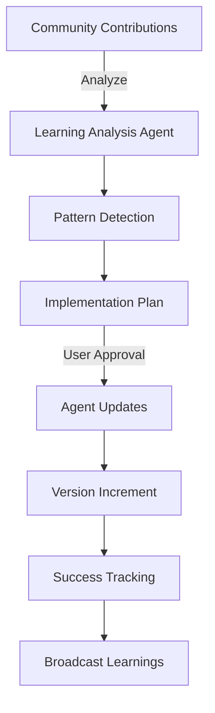

# Learning Analysis Agent Guide

## Overview

The Learning Analysis Agent (#37) is a specialized agent responsible for analyzing community contributions, identifying patterns, and implementing improvements across all AgileAiAgents. This agent represents the continuous improvement engine of the system.

## Agent Responsibilities

### Contribution Analysis
- Reviews all submitted community learnings
- Identifies common patterns across projects
- Extracts actionable improvements
- Prioritizes implementation based on impact

### Pattern Recognition
- **Success Patterns**: What works consistently well
- **Anti-Patterns**: What to avoid
- **Technology Patterns**: Framework-specific insights
- **Coordination Patterns**: How agents work together effectively

### Implementation Planning
- Creates detailed implementation plans
- Assigns improvements to specific agents
- Estimates impact and risk
- Tracks implementation success

### Version Management
- Updates agent versions after improvements
- Maintains dual versioning system
- Tracks which contributions led to improvements
- Manages rollback capabilities

### Cross-Agent Learning
- Broadcasts high-confidence learnings
- Manages learning subscriptions
- Tracks adoption rates
- Measures effectiveness

## Implementation Guide

### Workflow Overview


### Analysis Process

1. **Data Collection**
   ```javascript
   analyzeContributions() {
     const contributions = loadRecentContributions();
     const patterns = extractPatterns(contributions);
     const recommendations = generateRecommendations(patterns);
     return { patterns, recommendations };
   }
   ```

2. **Pattern Extraction**
   - Minimum 3 similar occurrences
   - Confidence threshold > 0.7
   - Impact assessment
   - Risk evaluation

3. **Implementation Generation**
   - Specific code changes
   - Documentation updates
   - Test additions
   - Metric definitions

## Implementation Plans

### Plan Structure
```markdown
# Learning Implementation Plan

## Analysis Summary
- Contributions analyzed: 5
- Key patterns identified: 3
- Affected agents: [list]
- Expected impact: +15% efficiency

## Implementation Phases

### Phase 1: Update Coder Agent ⬜
- [ ] Add React 18 concurrent features pattern
- [ ] Update TypeScript configurations
- [ ] Add performance monitoring
- Expected impact: +20% render performance

### Phase 2: Enhance Testing Agent ⬜
- [ ] Add browser-based testing patterns
- [ ] Implement visual regression tests
- [ ] Add performance benchmarks
- Expected impact: +15% bug detection
```

### Approval Process
1. User reviews implementation plan
2. Can modify or reject specific phases
3. Approved phases are implemented
4. Success metrics tracked for 7 days

## Version Tracking

### Dual Versioning System
- **System Version**: `1.2.0` (official releases)
- **Self-Improvement Version**: `1.2.0+20250128.1`

### Version History Format
```markdown
## Version History

### v1.2.0+20250128.1
- **Source**: contributions/2025-01-27-saas-dashboard
- **Changes**: Added browser testing for SPAs
- **Impact**: +15% bug detection rate
- **Validated**: 2025-01-29
```

## Learning Broadcasts

### Broadcast Criteria
- Confidence > 0.9
- Validated in production
- Applicable to multiple agents
- Clear implementation path

### Broadcast Format
```json
{
  "source_agent": "coder_agent",
  "learning_type": "pattern",
  "title": "React 18 Concurrent Features",
  "description": "Improved render performance pattern",
  "confidence": 0.95,
  "applicable_to": ["testing_agent", "ui_ux_agent"],
  "implementation": {
    "code_changes": "...",
    "test_additions": "...",
    "documentation": "..."
  }
}
```

## Success Metrics

### Tracking Implementation Success
1. **Before Metrics**: Baseline measurements
2. **After Metrics**: Post-implementation measurements
3. **Validation Period**: 7 days monitoring
4. **Rollback Threshold**: -5% performance

### Key Metrics
- Development velocity
- Bug detection rate
- Token usage efficiency
- Time to deployment
- Error recovery time

## Commands and Usage

### Analyze Recent Contributions
```bash
npm run analyze-learnings
```
This command:
- Loads contributions from last 30 days
- Identifies patterns with 3+ occurrences
- Generates implementation plan
- Saves to project-documents

### View Learning Report
```bash
npm run learning-report
```
Shows:
- Recent implementations
- Success metrics
- Failed improvements
- Upcoming plans

### Force Analysis (Admin)
```bash
node machine-data/learning-analysis-workflow.js analyze --force
```
Analyzes all contributions regardless of date.

## Integration Points

### With Project State Manager
- Receives learning capture notifications
- Updates learning state
- Triggers contribution prompts

### With Other Agents
- Sends implementation instructions
- Receives success/failure reports
- Coordinates version updates

### With Version Manager
- Requests version updates
- Tracks improvement history
- Manages rollbacks

## Best Practices

### For Contribution Analysis
1. Wait for 3+ similar patterns
2. Validate with real metrics
3. Start with low-risk improvements
4. Monitor for 7 days minimum

### For Implementation
1. Make atomic changes
2. Include tests with changes
3. Document the learning source
4. Track specific metrics

### For Broadcasting
1. Only broadcast proven patterns
2. Include clear implementation
3. Make adoption optional
4. Track adoption success

## Troubleshooting

### Troubleshooting

**Pattern Detection Too Sensitive**
- Increase minimum occurrence to 5
- Raise confidence threshold to 0.8

**Implementations Failing**
- Check agent compatibility
- Verify test coverage
- Review rollback logs

**Low Adoption Rates**
- Improve implementation clarity
- Add more examples
- Lower confidence requirements

## Future Enhancements

### Planned Features
1. **ML-Based Pattern Detection**: Use machine learning for deeper insights
2. **Predictive Impact**: Estimate improvement impact before implementation
3. **A/B Testing**: Test improvements on subset of projects
4. **Community Voting**: Let users vote on proposed improvements

### Research Areas
- Cross-project learning networks
- Automatic code generation from patterns
- Performance prediction models
- Failure pattern prevention

---

**Remember**: The Learning Analysis Agent is the brain of AgileAiAgents' continuous improvement. Every contribution makes the system smarter for everyone!