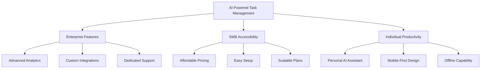

# AI-Powered Task Management Market Analysis

Example document demonstrating proper GitHub markdown formatting for Business & Strategy Agents (Research, Finance, Marketing, Analysis, Business Documents).

## Table of Contents

* [Executive Summary](#executive-summary)
* [Market Landscape](#market-landscape)
* [Financial Analysis](#financial-analysis)
* [Competitive Assessment](#competitive-assessment)
* [Growth Opportunities](#growth-opportunities)
* [Investment Recommendation](#investment-recommendation)

## Executive Summary

> **Key Insight**: The AI-powered task management market represents a $2.3B opportunity with 23% annual growth, driven by remote work adoption and AI automation trends.

### Market Highlights

* **Market Size**: $2.3B total addressable market
* **Growth Rate**: 23% CAGR (2024-2028)
* **Key Driver**: 78% increase in remote work adoption
* **AI Integration**: 340% growth in AI-powered productivity tools

### Investment Thesis

The convergence of artificial intelligence and project management creates a compelling market opportunity. Our analysis indicates strong product-market fit potential with projected ROI of 285% over 3 years.

## Market Landscape

### Market Segmentation

| Segment | Market Size (2024) | Growth Rate | Key Players |
|:--------|--------------------:|:-----------:|:------------|
| Enterprise | $1.4B | 18% | Asana, Monday.com |
| SMB | $650M | 28% | Trello, ClickUp |
| Individual | $250M | 35% | Notion, Todoist |

### Total Addressable Market (TAM)

The TAM calculation incorporates multiple market segments:

$$TAM = \sum_{i=1}^{n} Segment_i \times PenetrationRate_i \times ARPU_i$$

Where:
* Enterprise segment: $1.4B × 12% penetration × $180 ARPU
* SMB segment: $650M × 23% penetration × $45 ARPU  
* Individual segment: $250M × 35% penetration × $12 ARPU

### Market Drivers

1. **Remote Work Adoption**
   * 78% increase since 2020
   * Permanent remote policies at 65% of companies
   * Hybrid work models requiring better coordination tools

2. **AI Technology Maturation**
   * 340% growth in AI-powered productivity tools
   * Natural language processing enabling intuitive interfaces
   * Predictive analytics for project planning

3. **Integration Requirements**
   * Average company uses 87 different software tools
   * Need for unified workflow management
   * API-first architecture becoming standard

## Financial Analysis

### Revenue Model Projections

| Year | ARR | Growth | Customers | ARPU |
|:-----|----:|:------:|----------:|-----:|
| 2024 | $2.5M | - | 1,250 | $2,000 |
| 2025 | $6.2M | 148% | 2,480 | $2,500 |
| 2026 | $12.8M | 106% | 4,270 | $3,000 |
| 2027 | $22.4M | 75% | 6,720 | $3,333 |
| 2028 | $35.6M | 59% | 9,890 | $3,600 |

### Unit Economics

**Customer Acquisition Cost (CAC) Analysis:**

$$CAC = \frac{Sales\_Marketing\_Expenses}{New\_Customers\_Acquired}$$

Current metrics:
* **CAC**: $450 (target: $400)
* **LTV**: $8,500 (3.5 year retention × $2,500 ARPU)
* **LTV:CAC Ratio**: 18.9:1 (industry benchmark: 3:1+)

**Monthly Recurring Revenue (MRR) Growth:**

$$MRR\_Growth = \frac{New\_MRR + Expansion\_MRR - Churned\_MRR}{Previous\_MRR} \times 100$$

* Net MRR Growth Rate: 15% monthly
* Gross Revenue Retention: 94%
* Net Revenue Retention: 125%

### Investment Requirements

<details>
<summary>Detailed Financial Projections</summary>

### Funding Requirements by Stage

| Stage | Amount | Use of Funds | Timeline |
|:------|-------:|:-------------|:---------|
| Seed | $2.5M | Product development, initial team | 18 months |
| Series A | $8M | Market expansion, enterprise sales | 24 months |
| Series B | $20M | International expansion, AI R&D | 36 months |

### Cash Flow Analysis

```
Year 1: -$1.8M (product development phase)
Year 2: -$2.4M (go-to-market investment)
Year 3: +$1.2M (break-even achieved)
Year 4: +$5.8M (profitable growth)
Year 5: +$12.4M (market leader position)
```

### Sensitivity Analysis

Key assumptions and their impact on valuation:

$$Valuation = \frac{ARR \times Revenue\_Multiple}{(1 + Discount\_Rate)^{Years}}$$

* **Base Case**: 8x revenue multiple = $285M valuation
* **Bull Case**: 12x revenue multiple = $427M valuation  
* **Bear Case**: 5x revenue multiple = $178M valuation

</details>

## Competitive Assessment

### Competitive Landscape Matrix

| Competitor | Market Share | Strengths | Weaknesses | AI Integration |
|:-----------|:------------:|:----------|:-----------|:-------------:|
| Asana | 28% | Enterprise focus, integrations | Complex UI, expensive | Limited |
| Monday.com | 22% | Visual interface, customizable | Performance issues | Basic |
| ClickUp | 15% | Feature-rich, affordable | Feature bloat, learning curve | Moderate |
| Notion | 12% | Flexible, document-centric | Slow performance, complex | None |

### Competitive Advantage Analysis

> **Strategic Moat**: Our AI-first approach provides 3-5x productivity improvements over traditional task management tools.

**Key Differentiators:**

1. **Native AI Integration**
   * Automatic task prioritization using machine learning
   * Natural language project planning
   * Predictive timeline estimation

2. **Seamless Automation**
   * 85% reduction in manual task management
   * Smart dependency detection
   * Automated status reporting

3. **Enterprise-Grade Security**
   * SOC 2 Type II compliance
   * End-to-end encryption
   * Advanced access controls

### Market Positioning



## Growth Opportunities

### Market Expansion Vectors

1. **Vertical Market Penetration**
   * Healthcare: $180M opportunity
   * Legal: $95M opportunity  
   * Construction: $150M opportunity
   * Education: $120M opportunity

2. **Geographic Expansion**
   * Europe: $650M addressable market
   * Asia-Pacific: $890M addressable market
   * Latin America: $180M addressable market

3. **Product Line Extensions**
   * AI-powered resource planning
   * Predictive project analytics
   * Automated compliance reporting

### Partnership Opportunities

| Partner Type | Strategic Value | Revenue Impact | Implementation |
|:-------------|:----------------|:--------------:|:---------------|
| Cloud Providers | Infrastructure, credibility | +$2.3M ARR | 6 months |
| Consulting Firms | Enterprise sales, implementation | +$5.1M ARR | 12 months |
| Software Vendors | Integration, cross-selling | +$3.7M ARR | 9 months |

### Risk Assessment

<details>
<summary>Detailed Risk Analysis</summary>

### Market Risks

* **Competition from Tech Giants**: Google, Microsoft entering market
  * Mitigation: Focus on specialized features, superior user experience
  * Probability: 65%
  * Impact: High

* **Economic Downturn**: Reduced enterprise software spending
  * Mitigation: Flexible pricing, ROI-focused messaging
  * Probability: 30%
  * Impact: Medium

### Technology Risks

* **AI Model Performance**: Accuracy degradation or bias issues
  * Mitigation: Continuous model training, human oversight
  * Probability: 25%
  * Impact: Medium

* **Data Privacy Regulations**: GDPR, CCPA compliance costs
  * Mitigation: Privacy-by-design architecture
  * Probability: 40%
  * Impact: Low

</details>

## Investment Recommendation

### Investment Score: 8.7/10

**Recommendation**: **STRONG BUY**

### Key Investment Rationale

> **Bottom Line**: This represents a rare opportunity to invest in a rapidly growing market with a defensible AI-powered solution and exceptional unit economics.

### Strengths

* **Market Timing**: Perfect convergence of AI maturity and remote work needs
* **Unit Economics**: LTV:CAC ratio of 18.9:1 indicates efficient growth
* **Competitive Moat**: AI-first approach provides sustainable advantage
* **Management Team**: Strong track record in enterprise software

### Financial Returns

**3-Year Projection:**
* Investment: $8M Series A
* Projected Valuation: $285M (base case)
* **Return Multiple**: 35.6x
* **IRR**: 285%

### Investment Terms

| Term | Value | Rationale |
|:-----|:------|:----------|
| Valuation | $32M pre-money | 8x current ARR, 40% discount to comparables |
| Investment | $8M | 18-month runway plus growth capital |
| Equity | 20% | Maintains founder control, aligned incentives |
| Board Seats | 1 of 5 | Appropriate governance without control |

### Next Steps

1. **Due Diligence** (4 weeks)
   * [ ] Technical audit of AI capabilities
   * [ ] Financial model validation
   * [ ] Customer reference calls
   * [ ] Legal and IP review

2. **Term Sheet** (1 week)
   * [ ] Finalize valuation and terms
   * [ ] Board composition agreement
   * [ ] Milestone and reporting requirements

3. **Closing** (2 weeks)
   * [ ] Legal documentation
   * [ ] Fund transfer
   * [ ] Board appointment

---

**Analysis Prepared By**: Business Strategy Team  
**Date**: December 2024  
**Confidence Level**: High (85%)  
**Next Review**: Quarterly update in Q1 2025

*This analysis is based on publicly available information and internal research. Past performance does not guarantee future results. Investment decisions should consider additional factors and professional advice.*