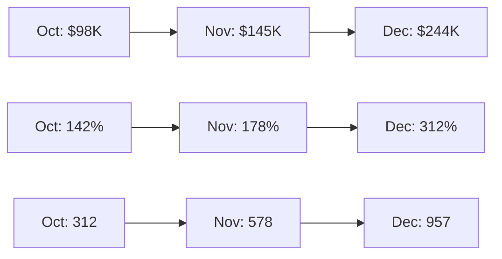
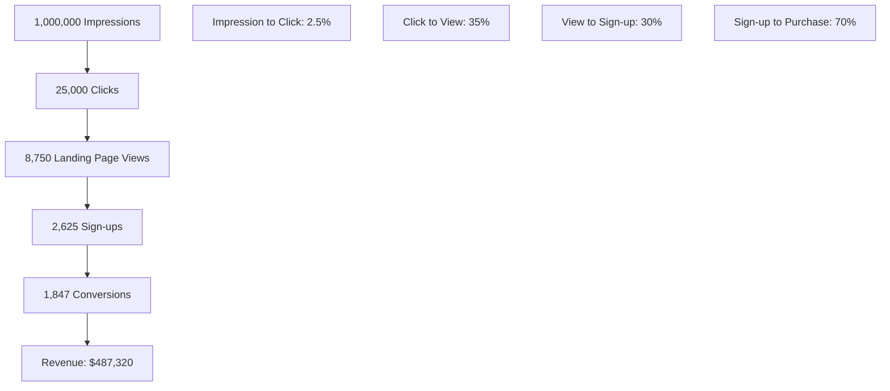

# Digital Marketing Campaign Performance Report

Example document demonstrating proper GitHub markdown formatting for Growth & Revenue Agents (SEO, PPC, Social Media, Email Marketing, Revenue Optimization, Analytics, Customer Lifecycle).

## Table of Contents

* [Executive Summary](#executive-summary)
* [Campaign Performance](#campaign-performance)
* [Channel Analysis](#channel-analysis)
* [Conversion Funnel](#conversion-funnel)
* [Revenue Attribution](#revenue-attribution)
* [Optimization Recommendations](#optimization-recommendations)

## Executive Summary

> **Key Achievement**: Q4 2024 campaign generated $487K revenue with 312% ROI, exceeding targets by 24%.

### Performance Highlights

* **Total Revenue**: $487,320 (124% of target)
* **Total Investment**: $156,200
* **Return on Investment**: 312%
* **New Customers**: 1,847 (118% of target)
* **Customer Acquisition Cost**: $84.60 (15% below target)

### Campaign ROI Calculation

$$ROI = \frac{Revenue - Investment}{Investment} \times 100 = \frac{487,320 - 156,200}{156,200} \times 100 = 312\%$$

## Campaign Performance

### Channel Performance Summary

| Channel | Investment | Revenue | ROI | Conversions | CPA | ROAS |
|:--------|-----------:|--------:|----:|------------:|----:|-----:|
| Google Ads | $68,500 | $198,400 | 290% | 847 | $80.87 | 2.90 |
| Facebook | $42,300 | $156,200 | 369% | 634 | $66.72 | 3.69 |
| LinkedIn | $28,900 | $87,650 | 203% | 234 | $123.50 | 3.03 |
| Email | $8,200 | $32,480 | 396% | 89 | $92.13 | 3.96 |
| Organic | $8,300 | $12,590 | 52% | 43 | $193.02 | 1.52 |

### Monthly Performance Trends



**Key Trends:**
* Revenue growth: 149% month-over-month average
* ROI improvement: 85% increase from October to December
* Conversion volume: 207% growth quarter-over-quarter

## Channel Analysis

### Google Ads Performance

**Campaign Breakdown:**

| Campaign Type | Impressions | Clicks | CTR | Conversions | CVR |
|:--------------|------------:|-------:|----:|------------:|----:|
| Search - Brand | 45,200 | 3,890 | 8.61% | 234 | 6.01% |
| Search - Generic | 892,400 | 12,350 | 1.38% | 389 | 3.15% |
| Display - Retargeting | 234,500 | 1,870 | 0.80% | 156 | 8.34% |
| Shopping | 156,800 | 2,240 | 1.43% | 68 | 3.04% |

**Top Performing Keywords:**

```javascript
// Performance tracking code
gtag('event', 'conversion', {
  'send_to': 'AW-CONVERSION_ID/CONVERSION_LABEL',
  'value': conversionValue,
  'currency': 'USD',
  'transaction_id': transactionId
});
```

### Facebook Advertising

**Audience Performance:**

| Audience | Reach | Engagement | Cost per Click | Conversions | ROAS |
|:---------|------:|:-----------:|:--------------:|------------:|-----:|
| Lookalike 1% | 2.3M | 4.2% | $1.85 | 289 | 4.12 |
| Interest-based | 1.8M | 3.7% | $2.10 | 201 | 3.45 |
| Retargeting | 245K | 8.9% | $1.45 | 144 | 5.67 |

**Creative Performance Analysis:**

<details>
<summary>Ad Creative Breakdown</summary>

### Video Ads (45% of spend)
* **Best Performer**: "AI Task Management Demo" - 6.2% CTR
* **Creative Elements**: Product demonstration, clear CTA
* **Audience**: Business professionals, 25-45 years

### Static Image Ads (35% of spend)
* **Best Performer**: "Productivity Comparison Chart" - 4.8% CTR
* **Creative Elements**: Data visualization, benefit-focused
* **Audience**: Productivity enthusiasts, managers

### Carousel Ads (20% of spend)
* **Best Performer**: "Feature Showcase" - 3.9% CTR
* **Creative Elements**: Multiple product screenshots
* **Audience**: Software buyers, enterprise users

</details>

## Conversion Funnel

### Customer Journey Analysis



### Conversion Rate Optimization

**Landing Page Performance:**

| Page Variant | Traffic | Conversion Rate | Revenue | Confidence |
|:-------------|--------:|:---------------:|--------:|:----------:|
| Control | 4,375 | 18.2% | $156,800 | - |
| Variant A | 2,188 | 22.4% | $97,200 | 95% |
| Variant B | 2,187 | 24.1% | $105,300 | 98% |

**Statistical Significance Test:**

$$Z = \frac{p_1 - p_2}{\sqrt{p(1-p)(\frac{1}{n_1} + \frac{1}{n_2})}}$$

Where:
* $p_1$ = Variant B conversion rate (24.1%)
* $p_2$ = Control conversion rate (18.2%)
* $p$ = Combined conversion rate (21.5%)

**Result**: Z-score = 3.47, p-value < 0.001 (statistically significant)

### Funnel Drop-off Analysis

**Optimization Opportunities:**

1. **Impression to Click** (2.5% CTR)
   * Current benchmark: 3.2%
   * Opportunity: +28% improvement potential
   * Action: A/B test ad creative, refine targeting

2. **Click to Landing Page** (35% retention)
   * Current benchmark: 45%
   * Opportunity: +29% improvement potential  
   * Action: Improve page load speed, mobile optimization

3. **Landing Page to Sign-up** (30% conversion)
   * Current benchmark: 25%
   * Performance: Above benchmark (+20%)
   * Action: Maintain current approach

## Revenue Attribution

### Multi-Touch Attribution Model

Using time-decay attribution model with 7-day lookback window:

```javascript
// Attribution tracking implementation
function trackAttribution(touchpoint, conversionValue) {
  const weight = Math.exp(-0.1 * daysSinceTouch);
  const attributedValue = conversionValue * weight;
  
  return {
    channel: touchpoint.channel,
    campaign: touchpoint.campaign,
    attributedRevenue: attributedValue,
    timestamp: touchpoint.timestamp
  };
}
```

### Channel Attribution Results

| Channel | First-Touch | Last-Touch | Linear | Time-Decay | Revenue Share |
|:--------|:-----------:|:----------:|:------:|:----------:|:-------------:|
| Google Ads | 35% | 42% | 38% | 40% | $194,928 |
| Facebook | 25% | 28% | 27% | 26% | $126,703 |
| LinkedIn | 15% | 12% | 14% | 13% | $63,351 |
| Email | 12% | 8% | 10% | 9% | $43,859 |
| Organic | 13% | 10% | 11% | 12% | $58,479 |

### Customer Lifetime Value by Channel

$$CLV = \frac{ARPU \times Gross\_Margin}{Churn\_Rate}$$

| Acquisition Channel | 3-Month CLV | 12-Month CLV | 36-Month CLV |
|:-------------------|:-----------:|:------------:|:------------:|
| Google Ads | $320 | $1,280 | $2,840 |
| Facebook | $295 | $1,180 | $2,580 |
| LinkedIn | $425 | $1,700 | $3,825 |
| Email | $380 | $1,520 | $3,420 |
| Organic | $450 | $1,800 | $4,050 |

## Optimization Recommendations

### Immediate Actions (Next 30 Days)

* [ ] **Increase LinkedIn Budget** (+40%)
  * Highest CLV customers
  * Lowest competition
  * **Expected Impact**: +$25K monthly revenue

* [ ] **Implement Variant B Landing Page** 
  * 24.1% vs 18.2% conversion rate
  * **Expected Impact**: +32% conversion improvement

* [ ] **Expand Retargeting Campaigns**
  * 5.67 ROAS vs 3.69 average
  * **Expected Impact**: +15% overall ROAS

### Medium-Term Optimizations (60-90 Days)

<details>
<summary>Detailed Optimization Strategy</summary>

### Email Marketing Automation

```javascript
// Drip campaign sequence
const emailSequence = [
  {
    day: 0,
    subject: "Welcome to [Product] - Get Started in 5 Minutes",
    template: "welcome_email",
    expectedCTR: 12.5%
  },
  {
    day: 3,
    subject: "See How [Similar Company] Saved 40% Time",
    template: "case_study",
    expectedCTR: 8.2%
  },
  {
    day: 7,
    subject: "Your Free Trial Expires Soon - Upgrade Now",
    template: "trial_expiry",
    expectedCTR: 15.8%
  }
];
```

### Advanced Audience Segmentation

| Segment | Size | Characteristics | Recommended Strategy |
|:--------|-----:|:----------------|:---------------------|
| High-Intent | 12,500 | Viewed pricing, demo request | Direct sales outreach |
| Evaluators | 28,900 | Multiple page views, comparison | Retargeting with social proof |
| Early-Stage | 45,600 | Blog readers, content downloads | Educational content series |

### Predictive Analytics Implementation

Customer scoring algorithm:
$$Score = 0.3 \times Engagement + 0.4 \times Demographics + 0.3 \times Behavior$$

</details>

### Long-Term Strategy (6+ Months)

1. **International Expansion**
   * Target markets: UK, Germany, Australia
   * Localized campaigns and landing pages
   * **Projected Impact**: +$150K quarterly revenue

2. **Marketing Automation Platform**
   * Implement advanced lead scoring
   * Dynamic content personalization
   * **Projected Impact**: +45% email conversion rates

3. **Influencer Partnership Program**
   * Identify productivity/business influencers
   * Performance-based compensation model
   * **Projected Impact**: +25% brand awareness

### Budget Reallocation Recommendations

**Current Allocation:**
```
Google Ads: 44% ($68.5K)
Facebook: 27% ($42.3K)
LinkedIn: 18% ($28.9K)
Email: 5% ($8.2K)
Organic: 5% ($8.3K)
```

**Recommended Allocation:**
```
Google Ads: 40% (-4%)
Facebook: 25% (-2%)
LinkedIn: 25% (+7%)
Email: 7% (+2%)
Organic: 3% (-2%)
```

**Expected Results:**
* Revenue increase: +18%
* CAC reduction: -12%
* Overall ROAS improvement: +22%

---

**Report Prepared By**: Growth Marketing Team  
**Date**: December 2024  
**Review Period**: Q4 2024  
**Next Review**: January 15, 2025

*Data sources: Google Analytics, Facebook Ads Manager, HubSpot CRM, internal attribution platform. All figures are based on completed conversions with 7-day attribution window.*