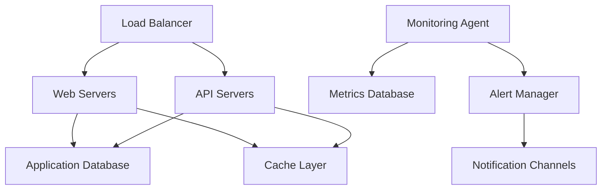
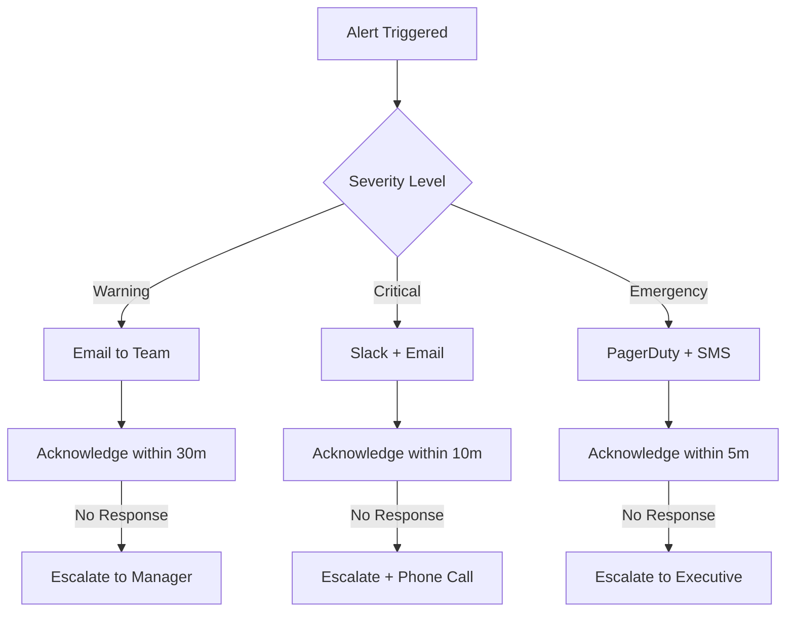

# System Monitoring and Performance Guide

Example document demonstrating proper GitHub markdown formatting for Support Agents (Documentation, Logger, Optimization, Dashboard, Project Analyzer, Document Manager, Project State Manager, Project Structure, Learning Analysis, VC Report).

## Table of Contents

* [Overview](#overview)
* [Monitoring Setup](#monitoring-setup)
* [Performance Metrics](#performance-metrics)
* [Alert Configuration](#alert-configuration)
* [Troubleshooting Guide](#troubleshooting-guide)
* [Maintenance Procedures](#maintenance-procedures)

## Overview

This guide demonstrates how Support Agents should format comprehensive documentation using GitHub markdown best practices, with focus on accessibility and cross-referencing.

### System Architecture Overview



### Related Documentation

* [Installation Guide](installation-guide.md)
* [Configuration Reference](configuration-reference.md)
* [API Documentation](api-documentation.md)
* [Security Guidelines](security-guidelines.md)
* [Backup Procedures](backup-procedures.md)

## Monitoring Setup

### Prerequisites

Before setting up monitoring, ensure you have:

* [ ] Administrative access to all servers
* [ ] Monitoring tools installed (Prometheus, Grafana)
* [ ] Network access between monitoring server and targets
* [ ] SSL certificates for secure connections
* [x] Database backup completed

### Installation Steps

1. **Install Monitoring Agent**

   ```bash
   # Download and install monitoring agent
   curl -LO https://releases.agileai.com/monitoring/latest/agent.tar.gz
   tar -xzf agent.tar.gz
   sudo ./install.sh
   ```

2. **Configure Data Collection**

   ```yaml
   # /etc/monitoring/config.yml
   global:
     scrape_interval: 15s
     evaluation_interval: 15s
   
   scrape_configs:
     - job_name: 'agileai-api'
       static_configs:
         - targets: ['localhost:3000']
       metrics_path: '/metrics'
       scrape_interval: 5s
   
     - job_name: 'agileai-web'
       static_configs:
         - targets: ['localhost:8080']
       metrics_path: '/health'
   ```

3. **Verify Installation**

   <details>
   <summary>Verification Commands</summary>

   ```bash
   # Check service status
   sudo systemctl status agileai-monitoring
   
   # Verify metrics collection
   curl http://localhost:9090/metrics
   
   # Test connectivity
   ./monitoring-test.sh --config /etc/monitoring/config.yml
   
   # View logs
   tail -f /var/log/agileai/monitoring.log
   ```

   Expected output:
   ```
   ✅ Monitoring agent: Running
   ✅ Metrics endpoint: Accessible
   ✅ Database connection: OK
   ✅ Alert manager: Connected
   ```

   </details>

## Performance Metrics

### Key Performance Indicators

| Metric | Target | Warning | Critical | Description |
|:-------|:------:|:-------:|:--------:|:------------|
| Response Time | <200ms | >500ms | >1000ms | Average API response time |
| CPU Usage | <70% | >80% | >90% | Server CPU utilization |
| Memory Usage | <80% | >85% | >95% | RAM utilization |
| Disk Space | <80% | >90% | >95% | Available disk space |
| Error Rate | <1% | >2% | >5% | HTTP 5xx error percentage |

### Real-Time Dashboard

Access the monitoring dashboard at: [https://monitoring.agileai.com](https://monitoring.agileai.com)

**Dashboard Components:**

* **System Health**: Overall system status indicator
* **Performance Graphs**: Real-time metrics visualization  
* **Alert Summary**: Active alerts and their severity
* **Resource Usage**: CPU, memory, disk, and network utilization
* **Application Metrics**: Business-specific KPIs

### Custom Metrics Configuration

```javascript
// Application performance tracking
const prometheus = require('prom-client');

// Custom metrics
const httpRequestDuration = new prometheus.Histogram({
  name: 'http_request_duration_seconds',
  help: 'Duration of HTTP requests in seconds',
  labelNames: ['method', 'route', 'status'],
  buckets: [0.1, 0.5, 1, 2, 5]
});

const activeUsers = new prometheus.Gauge({
  name: 'active_users_total',
  help: 'Number of currently active users',
  collect() {
    // Custom logic to count active users
    this.set(getUserCount());
  }
});

// Middleware to track request duration
app.use((req, res, next) => {
  const start = Date.now();
  
  res.on('finish', () => {
    const duration = (Date.now() - start) / 1000;
    httpRequestDuration
      .labels(req.method, req.route?.path || req.path, res.statusCode)
      .observe(duration);
  });
  
  next();
});
```

## Alert Configuration

### Alert Rules

```yaml
# alerts.yml
groups:
  - name: agileai-alerts
    rules:
      - alert: HighCPUUsage
        expr: cpu_usage_percent > 80
        for: 5m
        labels:
          severity: warning
        annotations:
          summary: "High CPU usage detected"
          description: "CPU usage is {{ $value }}% for more than 5 minutes"
      
      - alert: APIResponseTimeSlow
        expr: http_request_duration_seconds{quantile="0.95"} > 1
        for: 2m
        labels:
          severity: warning
        annotations:
          summary: "API response time is slow"
          description: "95th percentile response time is {{ $value }}s"
      
      - alert: DatabaseConnectionFailed
        expr: up{job="database"} == 0
        for: 1m
        labels:
          severity: critical
        annotations:
          summary: "Database connection failed"
          description: "Unable to connect to database"
```

### Notification Channels

| Channel | Use Case | Configuration | Response Time |
|:--------|:---------|:--------------|:-------------:|
| Email | Non-urgent alerts | SMTP server setup | 5-15 minutes |
| Slack | Team notifications | Webhook integration | 1-2 minutes |
| PagerDuty | Critical incidents | API key required | 30 seconds |
| SMS | Emergency alerts | Twilio integration | 30 seconds |

### Alert Escalation Matrix



## Troubleshooting Guide

### Common Issues and Solutions

#### Issue: High Memory Usage

**Symptoms:**
* Server response times increasing
* Out of memory errors in logs
* Application crashes or restarts

**Diagnostic Steps:**

1. **Check memory usage by process:**
   ```bash
   ps aux --sort=-%mem | head -10
   ```

2. **Analyze heap dumps (for Node.js):**
   ```bash
   # Generate heap dump
   kill -USR2 $(pgrep node)
   
   # Analyze with Chrome DevTools
   node --inspect heapdump.XXXXXX.heapsnapshot
   ```

3. **Review application logs:**
   ```bash
   grep -i "memory\|heap\|out of memory" /var/log/agileai/*.log
   ```

**Solutions:**

<details>
<summary>Memory Optimization Strategies</summary>

### Application-Level Fixes

```javascript
// Implement connection pooling
const pool = new Pool({
  connectionString: process.env.DATABASE_URL,
  max: 20,                    // Maximum connections
  idleTimeoutMillis: 30000,   // Close idle connections after 30s
  connectionTimeoutMillis: 2000, // Return error after 2s if no connection
});

// Add memory monitoring
const v8 = require('v8');

setInterval(() => {
  const heapStats = v8.getHeapStatistics();
  const used = heapStats.used_heap_size / 1024 / 1024;
  const total = heapStats.total_heap_size / 1024 / 1024;
  
  console.log(`Memory usage: ${used.toFixed(2)}MB / ${total.toFixed(2)}MB`);
  
  if (used / total > 0.9) {
    console.warn('High memory usage detected, consider garbage collection');
    global.gc && global.gc();
  }
}, 60000);
```

### Infrastructure-Level Fixes

* Increase server memory allocation
* Implement horizontal scaling
* Add memory-based auto-scaling rules
* Configure swap space as temporary measure

</details>

#### Issue: Database Connection Timeouts

**Symptoms:**
* "Connection timeout" errors in application logs
* Slow query performance
* Failed API requests

**Diagnostic Commands:**

```sql
-- Check active connections
SELECT 
    state,
    COUNT(*) as connection_count
FROM pg_stat_activity 
GROUP BY state;

-- Identify long-running queries
SELECT 
    pid,
    now() - pg_stat_activity.query_start AS duration,
    query 
FROM pg_stat_activity 
WHERE (now() - pg_stat_activity.query_start) > interval '5 minutes';

-- Check database locks
SELECT 
    blocked_locks.pid AS blocked_pid,
    blocked_activity.usename AS blocked_user,
    blocking_locks.pid AS blocking_pid,
    blocking_activity.usename AS blocking_user,
    blocked_activity.query AS blocked_statement,
    blocking_activity.query AS current_statement_in_blocking_process
FROM pg_catalog.pg_locks blocked_locks
JOIN pg_catalog.pg_stat_activity blocked_activity ON blocked_activity.pid = blocked_locks.pid
JOIN pg_catalog.pg_locks blocking_locks ON blocking_locks.locktype = blocked_locks.locktype
JOIN pg_catalog.pg_stat_activity blocking_activity ON blocking_activity.pid = blocking_locks.pid
WHERE NOT blocked_locks.granted;
```

#### Issue: SSL Certificate Expiration

**Automated Monitoring Script:**

```bash
#!/bin/bash
# ssl-check.sh - Monitor SSL certificate expiration

DOMAINS=("api.agileai.com" "app.agileai.com" "monitoring.agileai.com")
WARNING_DAYS=30
CRITICAL_DAYS=7

for domain in "${DOMAINS[@]}"; do
    # Get certificate expiration date
    cert_date=$(openssl s_client -servername $domain -connect $domain:443 < /dev/null 2>/dev/null | \
                openssl x509 -noout -dates | grep notAfter | cut -d= -f2)
    
    # Convert to epoch time
    cert_epoch=$(date -d "$cert_date" +%s)
    current_epoch=$(date +%s)
    
    # Calculate days until expiration
    days_until_expiry=$(( (cert_epoch - current_epoch) / 86400 ))
    
    # Send alerts based on remaining days
    if [ $days_until_expiry -le $CRITICAL_DAYS ]; then
        echo "CRITICAL: SSL certificate for $domain expires in $days_until_expiry days"
        # Send critical alert
    elif [ $days_until_expiry -le $WARNING_DAYS ]; then
        echo "WARNING: SSL certificate for $domain expires in $days_until_expiry days"
        # Send warning alert
    else
        echo "OK: SSL certificate for $domain expires in $days_until_expiry days"
    fi
done
```

## Maintenance Procedures

### Regular Maintenance Schedule

| Task | Frequency | Responsibility | Estimated Time |
|:-----|:----------|:---------------|:--------------:|
| System updates | Weekly | DevOps Team | 2 hours |
| Database optimization | Monthly | DBA | 4 hours |
| Log rotation | Daily | Automated | 5 minutes |
| Backup verification | Weekly | Operations | 1 hour |
| Security patches | As needed | Security Team | 1-4 hours |

### Maintenance Windows

**Scheduled Maintenance:**
* **Standard**: Sundays 2:00 AM - 4:00 AM UTC
* **Extended**: First Sunday of month 12:00 AM - 6:00 AM UTC
* **Emergency**: As needed with 2-hour notice

**Pre-Maintenance Checklist:**

* [ ] Notify users 48 hours in advance
* [ ] Create database backup
* [ ] Prepare rollback procedures
* [ ] Test changes in staging environment
* [ ] Verify monitoring and alerting
* [ ] Coordinate with on-call team

### Backup and Recovery

```bash
#!/bin/bash
# backup-system.sh - Comprehensive backup script

BACKUP_DIR="/backups/$(date +%Y-%m-%d)"
mkdir -p $BACKUP_DIR

# Database backup
echo "Creating database backup..."
pg_dump -h localhost -U postgres agileai_production | gzip > $BACKUP_DIR/database.sql.gz

# Application files backup
echo "Backing up application files..."
tar -czf $BACKUP_DIR/application.tar.gz /opt/agileai/

# Configuration backup
echo "Backing up configuration..."
cp -r /etc/agileai/ $BACKUP_DIR/config/

# Upload to cloud storage
echo "Uploading to cloud storage..."
aws s3 sync $BACKUP_DIR s3://agileai-backups/$(date +%Y-%m-%d)/

# Cleanup old backups (keep 30 days)
find /backups -type d -mtime +30 -exec rm -rf {} \;

echo "Backup completed successfully"
```

### Performance Optimization

**Database Optimization:**

```sql
-- Update table statistics
ANALYZE;

-- Rebuild indexes
REINDEX DATABASE agileai_production;

-- Clean up old data
DELETE FROM audit_logs WHERE created_at < NOW() - INTERVAL '90 days';
DELETE FROM session_data WHERE expires_at < NOW();

-- Check for unused indexes
SELECT 
    indexrelname as index_name,
    relname as table_name,
    idx_scan as times_used
FROM pg_stat_user_indexes 
WHERE idx_scan = 0;
```

**Application Optimization:**

```javascript
// Enable compression
app.use(compression({
  filter: (req, res) => {
    if (req.headers['x-no-compression']) {
      return false;
    }
    return compression.filter(req, res);
  }
}));

// Implement caching
const redis = require('redis');
const client = redis.createClient();

app.get('/api/data', async (req, res) => {
  const cacheKey = `data:${req.params.id}`;
  
  // Try cache first
  const cached = await client.get(cacheKey);
  if (cached) {
    return res.json(JSON.parse(cached));
  }
  
  // Fetch from database
  const data = await fetchFromDatabase(req.params.id);
  
  // Cache for 5 minutes
  await client.setex(cacheKey, 300, JSON.stringify(data));
  
  res.json(data);
});
```

---

**Documentation Maintained By**: Support Team  
**Last Updated**: December 2024  
**Review Schedule**: Monthly  
**Emergency Contact**: support@agileai.com

> **Accessibility Note**: This document uses semantic headings, descriptive link text, and properly formatted tables for screen reader compatibility. All code examples include comments explaining their purpose.

*For additional support, consult our [knowledge base](https://help.agileai.com) or contact the support team through our [ticketing system](https://tickets.agileai.com).*