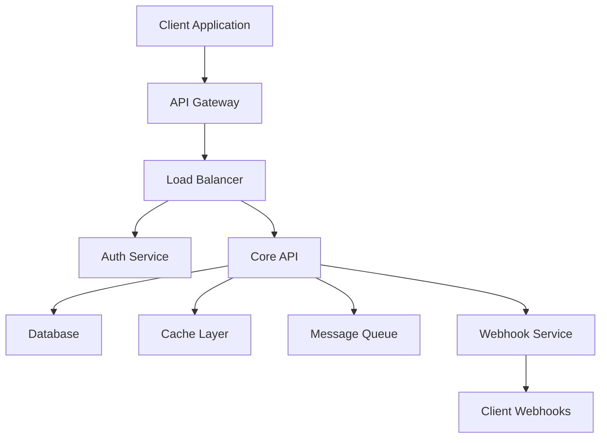

# REST API Integration Guide

Example document demonstrating proper GitHub markdown formatting for Technical Integration Agents (API, LLM, MCP, ML, Data Engineer).

## Table of Contents

* [Overview](#overview)
* [Authentication](#authentication)
* [API Endpoints](#api-endpoints)
* [Data Models](#data-models)
* [SDK Integration](#sdk-integration)
* [Error Handling](#error-handling)
* [Rate Limiting](#rate-limiting)
* [Webhooks](#webhooks)

## Overview

This guide demonstrates how Technical Integration Agents should format API documentation using GitHub markdown best practices.

### API Architecture



### Base URL and Versioning

```
Production: https://api.agileaiagents.com/v1
Staging: https://staging-api.agileaiagents.com/v1
```

**API Version Strategy:**
* Current version: `v1`
* Versioning scheme: Semantic versioning in URL path
* Deprecation policy: 12-month notice period

## Authentication

### API Key Authentication

```bash
curl -H "Authorization: Bearer YOUR_API_KEY" \
     https://api.agileaiagents.com/v1/projects
```

### OAuth 2.0 Flow

```javascript
// Step 1: Authorization URL
const authUrl = 'https://api.agileaiagents.com/oauth/authorize?' +
  'client_id=YOUR_CLIENT_ID&' +
  'redirect_uri=YOUR_REDIRECT_URI&' +
  'response_type=code&' +
  'scope=read write';

// Step 2: Exchange code for token
const tokenResponse = await fetch('https://api.agileaiagents.com/oauth/token', {
  method: 'POST',
  headers: {
    'Content-Type': 'application/json',
  },
  body: JSON.stringify({
    client_id: 'YOUR_CLIENT_ID',
    client_secret: 'YOUR_CLIENT_SECRET',
    code: 'AUTHORIZATION_CODE',
    grant_type: 'authorization_code'
  })
});

const { access_token, refresh_token } = await tokenResponse.json();
```

### Authentication Headers

| Header | Required | Description |
|:-------|:--------:|:------------|
| Authorization | Yes | Bearer token or API key |
| X-API-Version | No | API version override |
| X-Request-ID | No | Unique request identifier |

## API Endpoints

### Projects Endpoint

#### List Projects

```http
GET /v1/projects
```

**Parameters:**

| Parameter | Type | Required | Description |
|:----------|:-----|:--------:|:------------|
| limit | integer | No | Number of results (1-100, default: 20) |
| offset | integer | No | Pagination offset (default: 0) |
| status | string | No | Filter by status: `active`, `completed`, `archived` |
| created_after | datetime | No | ISO 8601 format |

**Response:**

```json
{
  "data": [
    {
      "id": "proj_1234567890",
      "name": "AI Task Manager",
      "description": "Intelligent task management system",
      "status": "active",
      "created_at": "2024-01-15T10:30:00Z",
      "updated_at": "2024-01-20T14:45:00Z",
      "team": {
        "id": "team_0987654321",
        "name": "Development Team"
      },
      "metrics": {
        "total_tasks": 145,
        "completed_tasks": 89,
        "completion_rate": 0.614
      }
    }
  ],
  "pagination": {
    "total": 1,
    "limit": 20,
    "offset": 0,
    "has_more": false
  }
}
```

#### Create Project

```http
POST /v1/projects
```

**Request Body:**

```json
{
  "name": "New Project",
  "description": "Project description",
  "team_id": "team_0987654321",
  "settings": {
    "auto_assign": true,
    "notifications": true,
    "ai_suggestions": true
  }
}
```

**Example Implementation:**

```python
import requests

def create_project(api_key, project_data):
    """
    Create a new project using the API
    
    Args:
        api_key (str): API authentication key
        project_data (dict): Project configuration
        
    Returns:
        dict: Created project data
        
    Raises:
        APIError: If request fails
    """
    headers = {
        'Authorization': f'Bearer {api_key}',
        'Content-Type': 'application/json'
    }
    
    response = requests.post(
        'https://api.agileaiagents.com/v1/projects',
        headers=headers,
        json=project_data
    )
    
    if response.status_code == 201:
        return response.json()
    else:
        raise APIError(f"Failed to create project: {response.text}")

# Usage
project = create_project(
    api_key='your_api_key',
    project_data={
        'name': 'AI Task Manager',
        'description': 'Intelligent task management system',
        'team_id': 'team_123'
    }
)
```

### Tasks Endpoint

<details>
<summary>Complete Tasks API Reference</summary>

#### List Tasks

```http
GET /v1/projects/{project_id}/tasks
```

**Query Parameters:**

```javascript
const params = new URLSearchParams({
  assignee: 'user_123',
  status: 'in_progress',
  priority: 'high',
  due_before: '2024-12-31T23:59:59Z',
  limit: '50',
  offset: '0'
});

fetch(`https://api.agileaiagents.com/v1/projects/proj_123/tasks?${params}`)
  .then(response => response.json())
  .then(data => console.log(data));
```

#### Create Task

```http
POST /v1/projects/{project_id}/tasks
```

**Request Schema:**

```typescript
interface CreateTaskRequest {
  title: string;
  description?: string;
  assignee_id?: string;
  priority: 'low' | 'medium' | 'high' | 'urgent';
  due_date?: string; // ISO 8601
  tags?: string[];
  dependencies?: string[]; // Task IDs
  estimated_hours?: number;
}
```

</details>

## Data Models

### Project Model

```typescript
interface Project {
  id: string;                    // Unique identifier
  name: string;                  // Project name
  description?: string;          // Optional description
  status: ProjectStatus;         // Current status
  team: Team;                    // Associated team
  settings: ProjectSettings;     // Configuration
  metrics: ProjectMetrics;       // Performance data
  created_at: string;           // ISO 8601 timestamp
  updated_at: string;           // ISO 8601 timestamp
}

enum ProjectStatus {
  DRAFT = 'draft',
  ACTIVE = 'active',
  COMPLETED = 'completed',
  ARCHIVED = 'archived'
}
```

### Task Model

```go
// Go struct for Task model
type Task struct {
    ID           string    `json:"id"`
    Title        string    `json:"title"`
    Description  *string   `json:"description,omitempty"`
    Status       string    `json:"status"`
    Priority     string    `json:"priority"`
    AssigneeID   *string   `json:"assignee_id,omitempty"`
    ProjectID    string    `json:"project_id"`
    DueDate      *string   `json:"due_date,omitempty"`
    Tags         []string  `json:"tags"`
    CreatedAt    string    `json:"created_at"`
    UpdatedAt    string    `json:"updated_at"`
}

// Task status constants
const (
    TaskStatusTodo       = "todo"
    TaskStatusInProgress = "in_progress"
    TaskStatusReview     = "review"
    TaskStatusDone       = "done"
)
```

## SDK Integration

### JavaScript/TypeScript SDK

```bash
npm install @agileaiagents/api-client
```

```typescript
import { AgileAIClient } from '@agileaiagents/api-client';

const client = new AgileAIClient({
  apiKey: process.env.AGILE_AI_API_KEY,
  baseUrl: 'https://api.agileaiagents.com/v1'
});

// Create project
const project = await client.projects.create({
  name: 'New Project',
  description: 'Project built with SDK'
});

// List tasks with filters
const tasks = await client.tasks.list(project.id, {
  status: 'in_progress',
  assignee: 'user_123',
  limit: 50
});

// Real-time updates using WebSocket
client.subscribe(`projects.${project.id}.tasks`, (event) => {
  console.log('Task updated:', event.data);
});
```

### Python SDK

```bash
pip install agileaiagents-python
```

```python
from agileaiagents import Client
from agileaiagents.exceptions import APIError

# Initialize client
client = Client(api_key=os.environ['AGILE_AI_API_KEY'])

# Context manager for automatic cleanup
async with client:
    try:
        # Create project
        project = await client.projects.create(
            name="Python SDK Project",
            description="Built with Python SDK"
        )
        
        # Bulk create tasks
        tasks_data = [
            {"title": f"Task {i}", "priority": "medium"}
            for i in range(1, 11)
        ]
        
        tasks = await client.tasks.bulk_create(
            project_id=project.id,
            tasks=tasks_data
        )
        
        print(f"Created {len(tasks)} tasks")
        
    except APIError as e:
        print(f"API Error: {e.message}")
        print(f"Status Code: {e.status_code}")
```

## Error Handling

### Error Response Format

```json
{
  "error": {
    "code": "VALIDATION_ERROR",
    "message": "Invalid request parameters",
    "details": [
      {
        "field": "due_date",
        "message": "Date must be in ISO 8601 format"
      }
    ],
    "request_id": "req_1234567890"
  }
}
```

### HTTP Status Codes

| Status Code | Meaning | Common Causes |
|:-----------:|:--------|:--------------|
| 200 | OK | Successful GET, PUT, DELETE |
| 201 | Created | Successful POST |
| 400 | Bad Request | Invalid parameters, malformed JSON |
| 401 | Unauthorized | Missing or invalid authentication |
| 403 | Forbidden | Insufficient permissions |
| 404 | Not Found | Resource doesn't exist |
| 409 | Conflict | Resource already exists, state conflict |
| 422 | Unprocessable Entity | Validation errors |
| 429 | Too Many Requests | Rate limit exceeded |
| 500 | Internal Server Error | Server-side error |

### Error Handling Examples

```javascript
// JavaScript error handling
async function handleAPICall() {
  try {
    const response = await fetch('/api/projects', {
      method: 'POST',
      headers: {
        'Authorization': `Bearer ${apiKey}`,
        'Content-Type': 'application/json'
      },
      body: JSON.stringify(projectData)
    });
    
    if (!response.ok) {
      const errorData = await response.json();
      throw new APIError(errorData.error.message, response.status);
    }
    
    return await response.json();
    
  } catch (error) {
    if (error instanceof APIError) {
      console.error(`API Error (${error.status}):`, error.message);
    } else {
      console.error('Network Error:', error.message);
    }
    throw error;
  }
}
```

## Rate Limiting

### Rate Limit Headers

Every API response includes rate limiting information:

```http
X-RateLimit-Limit: 1000
X-RateLimit-Remaining: 999
X-RateLimit-Reset: 1640995200
X-RateLimit-Window: 3600
```

### Rate Limit Tiers

| Tier | Requests/Hour | Burst Limit | Upgrade Path |
|:-----|:-------------:|:-----------:|:-------------|
| Free | 1,000 | 100/min | Contact sales |
| Pro | 10,000 | 500/min | Automatic |
| Enterprise | 100,000 | 2,000/min | Custom limits |

### Rate Limit Handling

```python
import time
from requests.adapters import HTTPAdapter
from urllib3.util.retry import Retry

def create_session_with_retries():
    """Create session with automatic retry on rate limits"""
    session = requests.Session()
    
    retry_strategy = Retry(
        total=3,
        backoff_factor=1,
        status_forcelist=[429, 500, 502, 503, 504],
    )
    
    adapter = HTTPAdapter(max_retries=retry_strategy)
    session.mount("http://", adapter)
    session.mount("https://", adapter)
    
    return session

def make_api_request(session, url, **kwargs):
    """Make API request with rate limit handling"""
    response = session.get(url, **kwargs)
    
    if response.status_code == 429:
        reset_time = int(response.headers.get('X-RateLimit-Reset', 0))
        wait_time = max(0, reset_time - int(time.time()))
        
        print(f"Rate limited. Waiting {wait_time} seconds...")
        time.sleep(wait_time + 1)
        
        # Retry request
        response = session.get(url, **kwargs)
    
    return response
```

## Webhooks

### Webhook Configuration

```http
POST /v1/webhooks
```

```json
{
  "url": "https://yourapp.com/webhooks/agileai",
  "events": [
    "task.created",
    "task.updated",
    "task.completed",
    "project.status_changed"
  ],
  "secret": "your_webhook_secret"
}
```

### Webhook Payload

```json
{
  "id": "evt_1234567890",
  "type": "task.completed",
  "created_at": "2024-01-20T15:30:00Z",
  "data": {
    "object": {
      "id": "task_9876543210",
      "title": "Implement API authentication",
      "status": "done",
      "completed_at": "2024-01-20T15:29:45Z",
      "assignee": {
        "id": "user_123",
        "name": "John Doe"
      }
    }
  }
}
```

### Webhook Verification

```javascript
const crypto = require('crypto');

function verifyWebhook(payload, signature, secret) {
  const computedSignature = crypto
    .createHmac('sha256', secret)
    .update(payload)
    .digest('hex');
    
  const expectedSignature = `sha256=${computedSignature}`;
  
  return crypto.timingSafeEqual(
    Buffer.from(signature),
    Buffer.from(expectedSignature)
  );
}

// Express.js webhook handler
app.post('/webhooks/agileai', express.raw({type: 'application/json'}), (req, res) => {
  const signature = req.headers['x-agileai-signature'];
  const payload = req.body;
  
  if (!verifyWebhook(payload, signature, process.env.WEBHOOK_SECRET)) {
    return res.status(401).send('Unauthorized');
  }
  
  const event = JSON.parse(payload);
  
  switch (event.type) {
    case 'task.completed':
      handleTaskCompleted(event.data.object);
      break;
    case 'project.status_changed':
      handleProjectStatusChanged(event.data.object);
      break;
    default:
      console.log(`Unhandled event type: ${event.type}`);
  }
  
  res.status(200).send('OK');
});
```

---

**API Documentation Version**: 1.2.0  
**Last Updated**: December 2024  
**Support**: [api-support@agileaiagents.com](mailto:api-support@agileaiagents.com)

*This documentation is automatically generated and tested. Report issues on our [GitHub repository](https://github.com/agileaiagents/api-docs).*