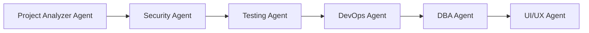
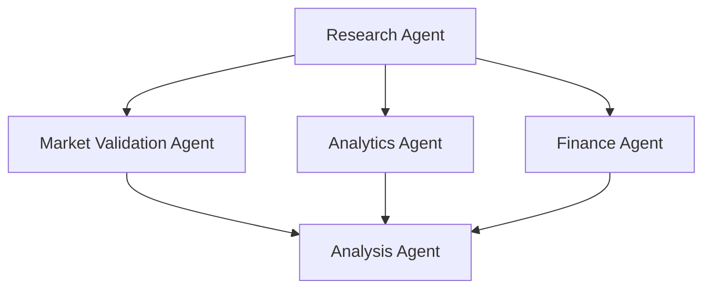
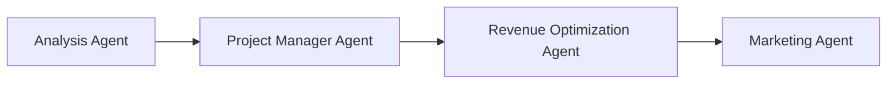

# Existing Project Agent Coordination

## Overview
Defines how agents coordinate when analyzing and enhancing existing projects with code-informed research.

## Agent Workflow Sequence

### Stage 1: Code Analysis (Sequential)


**Duration**: 2-4 hours
**Output**: Comprehensive code analysis report

### Stage 2: Research & Validation (Parallel)


**Duration**: 2-8 hours (depends on depth)
**Output**: Validation reports with code context

### Stage 3: Strategic Planning (Sequential)


**Duration**: 1-2 hours
**Output**: Strategic recommendations

## Agent Responsibilities

### Phase 1-2: Code Analysis Agents

#### Project Analyzer Agent (Lead)
```javascript
{
  role: "Orchestrator",
  responsibilities: [
    "Initial codebase scan",
    "Technology stack identification",
    "Architecture documentation",
    "Coordinate specialist agents"
  ],
  outputs: [
    "project-analysis-summary.md",
    "technology-stack.json",
    "architecture-diagram.md"
  ],
  handoff_to: ["Security", "Testing", "DevOps", "DBA", "UI/UX"]
}
```

#### Security Agent
```javascript
{
  role: "Security Auditor",
  inputs: ["codebase", "dependencies"],
  analysis: [
    "Vulnerability scanning",
    "Compliance gaps",
    "Security architecture review"
  ],
  outputs: [
    "security-audit.md",
    "vulnerability-report.json"
  ],
  feeds_into: "Research context"
}
```

#### Testing Agent
```javascript
{
  role: "Quality Assessor",
  inputs: ["codebase", "test suites"],
  analysis: [
    "Test coverage analysis",
    "Quality metrics",
    "Bug density assessment"
  ],
  outputs: [
    "quality-report.md",
    "test-coverage.json"
  ],
  feeds_into: "Technical debt calculation"
}
```

### Phase 5: Research Agents (Enhanced)

#### Research Agent (with Code Context)
```javascript
{
  role: "Market Researcher",
  enhanced_inputs: [
    "code_analysis_results",
    "feature_inventory",
    "performance_metrics",
    "technical_constraints"
  ],
  research_questions: [
    "generateFromCodeAnalysis()",
    "validateAgainstTechnicalReality()",
    "assessFeasibilityWithConstraints()"
  ],
  outputs: [
    "market-validation-existing.md",
    "competitive-comparison-actual.md",
    "feature-validation-report.md"
  ]
}
```

#### Market Validation Agent
```javascript
{
  role: "PMF Validator",
  code_informed_analysis: [
    "Match features to market needs",
    "Validate usage against demand",
    "Identify gaps vs opportunities"
  ],
  decision_framework: [
    "Strong validation → Accelerate",
    "Partial validation → Refocus",
    "Weak validation → Pivot",
    "No validation → Sunset"
  ],
  outputs: [
    "validation-decision-matrix.md",
    "pmf-assessment.json"
  ]
}
```

#### Analytics Agent
```javascript
{
  role: "Data Analyst",
  usage_analysis: [
    "Feature adoption rates",
    "User behavior patterns",
    "Churn correlation analysis",
    "Performance impact on usage"
  ],
  outputs: [
    "usage-analytics-insights.md",
    "behavior-patterns.json"
  ]
}
```

### Phase 6: Planning Agents

#### Analysis Agent (Synthesizer)
```javascript
{
  role: "Strategic Synthesizer",
  inputs: [
    "all_research_reports",
    "code_analysis",
    "market_validation",
    "usage_analytics"
  ],
  synthesis: [
    "Combine technical and market insights",
    "Calculate ROI for improvements",
    "Prioritize based on impact/effort",
    "Create decision matrix"
  ],
  outputs: [
    "executive-summary.md",
    "strategic-recommendations.md",
    "implementation-roadmap.md"
  ]
}
```

## Coordination Protocols

### Information Flow
```yaml
code_analysis:
  agents: [Project Analyzer, Security, Testing, DevOps, DBA, UI/UX]
  output: code_context.json
  
research_enrichment:
  input: code_context.json
  agents: [Research, Market Validation, Analytics]
  output: market_context.json
  
synthesis:
  inputs: [code_context.json, market_context.json]
  agent: Analysis
  output: recommendations.md
```

### Parallel Execution Rules
1. **Stage 1**: Sequential (each agent needs previous context)
2. **Stage 2**: Parallel (research agents work independently)
3. **Stage 3**: Sequential (synthesis requires all inputs)

### Context Passing
```javascript
// Code analysis context passed to research
const codeContext = {
  features: {
    implemented: ["auth", "dashboard", "reports"],
    unused: ["social", "gamification"],
    broken: ["search", "notifications"]
  },
  performance: {
    response_time: "250ms",
    scalability: "1000 users max",
    bottlenecks: ["database", "synchronous processing"]
  },
  technical_debt: {
    critical: ["security vulnerabilities", "no tests"],
    important: ["legacy dependencies", "poor error handling"]
  }
};

// Research uses code context for targeted analysis
const researchQuestions = generateQuestionsFromCode(codeContext);
```

## Decision Points

### After Code Analysis
```
Decision: Continue with research?
├─> Yes if: Codebase is viable
│   └─> Proceed to research phase
└─> No if: Critical issues found
    └─> Fix critical issues first
```

### After Research
```
Decision: What validation level?
├─> Strong (8-10): Accelerate growth
├─> Good (6-7.9): Optimize first
├─> Partial (4-5.9): Refocus product
├─> Weak (2-3.9): Consider pivot
└─> None (0-1.9): Plan exit
```

## Agent Communication Templates

### Code to Research Handoff
```markdown
## Code Analysis Complete

### Key Findings
- Features: [X implemented, Y unused]
- Performance: [Current metrics]
- Technical Debt: [Priority items]

### Research Context Needed
1. Validate feature [X] market demand
2. Assess impact of performance on users
3. Calculate ROI for fixing [debt item]

### Constraints for Research
- Can't scale beyond [limit]
- [Feature] not technically feasible
- Timeline: [X] months to implement
```

### Research to Analysis Handoff
```markdown
## Research Complete

### Market Validation
- Score: [X]/10
- Key findings: [Summary]

### Code-Informed Insights
- Feature [X]: High usage, strong demand ✅
- Feature [Y]: Low usage, no demand ❌
- Gap [Z]: High demand, feasible to build ⚠️

### Recommendations Preview
- Priority 1: [Action]
- Priority 2: [Action]
- Priority 3: [Action]
```

## Quality Checks

### Stage Gates
1. **Post Code Analysis**: All critical systems reviewed?
2. **Post Research**: All segments validated?
3. **Post Synthesis**: ROI calculated for all recommendations?

### Validation Requirements
- Code analysis: 100% coverage of production code
- Research: Minimum 20 customer data points
- Recommendations: Each backed by data

## Performance Metrics

### Agent Coordination Efficiency
- **Target**: Complete full analysis in 8 hours
- **Parallel Execution**: 60% time savings
- **Context Passing**: <1% information loss
- **Decision Accuracy**: 90% stakeholder agreement

### Output Quality Metrics
- **Completeness**: All templates filled
- **Accuracy**: Validated against real data
- **Actionability**: Clear next steps defined
- **Consensus**: All agents agree on path

## Error Handling

### Agent Failure Scenarios
```javascript
if (agentFailure) {
  switch(agent.type) {
    case 'critical':
      // Project Analyzer, Analysis Agent
      haltWorkflow();
      notifyUser();
      break;
    case 'important':
      // Research, Market Validation
      useDefaultValues();
      flagForManualReview();
      break;
    case 'optional':
      // Specific vertical agents
      skipAndContinue();
      noteInReport();
      break;
  }
}
```

### Conflict Resolution
When agents disagree:
1. Analysis Agent has final say
2. Use weighted voting based on expertise
3. Flag for human review if critical

## Continuous Improvement

### Feedback Loops
```
Results → Measurement → Learning → Update
   ↑                                    ↓
   └────────── Agent Configs ←──────────┘
```

### Learning Capture
- Document each analysis outcome
- Track prediction accuracy
- Update agent prompts based on results
- Share learnings across projects

---

**Version**: 1.0
**Last Updated**: [Date]
**Next Review**: After 10 project analyses