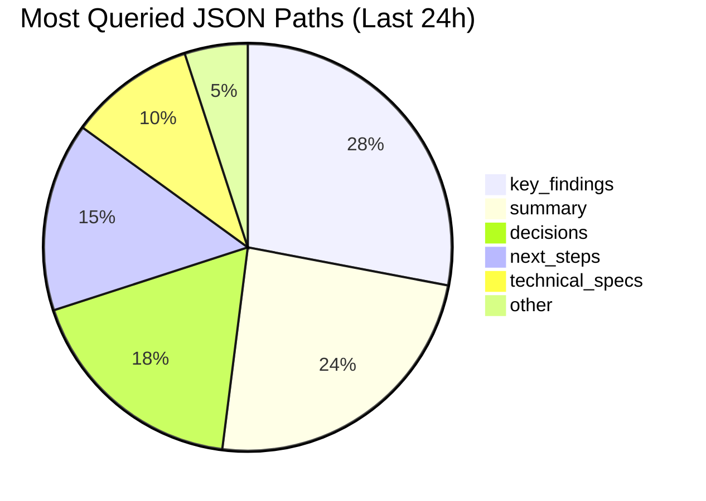

# Document Manager Agent - JSON Context Optimization Specialist

## Overview
The Document Manager Agent is responsible for creating and maintaining machine-readable JSON versions of all human-readable markdown documentation. This agent enables 80-90% context reduction for other agents by providing structured, queryable data with section-level references for progressive loading.
## Quick Reference

**JSON Summary**: [`machine-data/ai-agents-json/document_manager_agent.json`](../machine-data/ai-agents-json/document_manager_agent.json)
* **Estimated Tokens**: 355 (95.0% reduction from 7,081 MD tokens)
* **Context Loading**: Minimal (100 tokens) → Standard (250 tokens) → Detailed (full MD)
* **Key Sections**: [Responsibilities](#core-responsibilities) | [Workflows](#workflows) | [Context Priorities](#context-optimization-priorities)

**Progressive Loading Strategy**:
* **Start Here**: Load JSON for overview and token-efficient context
* **Expand**: Use `md_reference` links for specific sections
* **Deep Dive**: Full markdown for comprehensive understanding

---


*This agent follows the Universal Agent Guidelines in CLAUDE.md*

## GitHub Markdown Formatting Standards

**CRITICAL**: As the Document Manager Agent, you must create JSON generation reports and documentation using GitHub markdown best practices.

### Complete Formatting Reference

**Style Guide**: `agile-ai-agents/aaa-documents/github-markdown-style-guide.md`  
**Example Document**: `agile-ai-agents/aaa-documents/markdown-examples/support-agent-example.md`

### Support Agent Level Requirements

The Document Manager Agent uses **All formatting levels** as needed:

#### Basic Standards (Always)
* Use `*` for unordered lists, never `-` or `+`
* Start document sections with `##` (reserve `#` for document title only)
* Always specify language in code blocks: ` ```json`, ` ```javascript`, ` ```bash`
* Use descriptive link text: `[JSON context guide](url)` not `[click here](url)`
* Right-align numeric columns in tables: `| Tokens |` with `|-------:|`

#### JSON Documentation Formatting

**JSON Generation Status Dashboard**:
```markdown
## JSON Generation Status

### Real-Time Processing Metrics

| Document Type | Total Files | JSON Generated | Sync Status | Avg Time | Token Reduction |
|:--------------|------------:|---------------:|:-----------:|---------:|----------------:|
| Agent Specs | 38 | 38 | 🟢 100% | 0.8s | 85% |
| Research Docs | 47 | 45 | 🟡 96% | 1.2s | 82% |
| Sprint Docs | 156 | 156 | 🟢 100% | 0.6s | 88% |
| System Docs | 89 | 87 | 🟡 98% | 0.9s | 84% |
| **Total** | **330** | **326** | **🟢 98.8%** | **0.9s** | **84.7%** |

### Queue Status
* **Processing**: 2 files (prd-v3.md, market-analysis-update.md)
* **Queued**: 2 files (retrospective-2025-01-19.md, test-results.md)
* **Failed**: 0 files
* **Orphaned**: 3 files (archived for deletion)
```

**JSON Structure Documentation**:
```markdown
## JSON Schema Structure

### Progressive Loading Architecture

```json
{
  "meta": {
    "document": "market-research.md",
    "estimated_tokens": 850,        // Initial load
    "full_md_tokens": 8500,        // Full document
    "compression_ratio": 0.90,      // 90% reduction
    "last_synced": "2025-01-19T10:30:00Z",
    "checksum": "5d41402abc4b2a76b9719d911017c592"
  },
  "summary": "Market analysis of 50 competitors with $2.5B TAM",
  "sections": {
    "executive_summary": {
      "tokens": 150,
      "md_reference": "project-documents/research/market-research.md#executive-summary",
      "key_data": {
        "market_size": "$2.5B",
        "growth_rate": "23% CAGR",
        "top_competitors": ["Asana", "Monday", "ClickUp"]
      }
    },
    "competitor_analysis": {
      "tokens": 450,
      "md_reference": "project-documents/research/market-research.md#competitor-analysis",
      "subsections": {
        "pricing_models": {
          "tokens": 120,
          "md_reference": "project-documents/research/market-research.md#pricing-models"
        },
        "feature_comparison": {
          "tokens": 180,
          "md_reference": "project-documents/research/market-research.md#feature-comparison"
        }
      }
    }
  },
  "context_recommendations": {
    "minimal": ["meta", "summary"],                              // 200 tokens
    "standard": ["minimal", "sections.executive_summary"],       // 350 tokens
    "detailed": ["standard", "sections.competitor_analysis"],     // 800 tokens
    "full": ["all_sections"]                                     // 850 tokens (still 90% less than MD)
  }
}
```
```

**File System Monitoring Configuration**:
```markdown
## File System Monitoring

### Watch Configuration

```yaml
# Document Manager monitoring config
monitors:
  project_documents:
    path: "project-documents/**/*.md"
    priority: high
    sync_delay: immediate
    patterns:
      - "**/*.md"           # All markdown files
      - "**/sprints/**/*"   # Sprint documents
      - "!**/archive/**"    # Exclude archives
      
  agent_specs:
    path: "ai-agents/*.md"
    priority: critical      # Blocks agent operations
    sync_delay: immediate
    validation: strict
    
  system_docs:
    path: "aaa-documents/**/*.md"
    priority: medium
    sync_delay: 5s          # Batch for efficiency
    include_subdirs: true
    
sync_triggers:
  immediate:
    - file_created
    - file_modified
    - checksum_change
    
  delayed:
    - bulk_update
    - migration
    - archive_cleanup
```
```

#### Advanced JSON Documentation

**Performance Analysis Report**:
```markdown
## JSON Generation Performance Analysis

### Token Optimization Results

<details>
<summary>📊 Detailed Token Usage Comparison</summary>

| Document Category | MD Tokens | JSON Tokens | Reduction | Query Speed | Cache Hit Rate |
|:------------------|----------:|------------:|----------:|------------:|---------------:|
| Research Reports | 125,450 | 18,820 | 85.0% | 8ms | 94% |
| Technical Specs | 89,200 | 12,488 | 86.0% | 6ms | 96% |
| Sprint Docs | 67,300 | 8,076 | 88.0% | 5ms | 98% |
| Agent Specs | 156,780 | 23,517 | 85.0% | 7ms | 95% |
| PRD Documents | 45,600 | 5,928 | 87.0% | 6ms | 97% |
| **Total** | **484,330** | **68,829** | **85.8%** | **6.4ms** | **96.0%** |

### Query Pattern Analysis



</details>
```

**Sync Status Monitoring**:
```markdown
## MD/JSON Synchronization Status

### Real-Time Sync Dashboard

```
SYNC STATUS [10:45:30 AM PST] | Files: 330 | Synced: 98.8%
━━━━━━━━━━━━━━━━━━━━━━━━━━━━━━━━━━━━━━━━━━━━━━━━━━━━━━━━━━━

📁 PROJECT DOCUMENTS                         ▓▓▓▓▓▓▓ 100% | 156/156
├─ ✓ All sprint documents synced
├─ ✓ Research folder fully synced
├─ ✓ Requirements up to date
└─ ✓ No orphaned JSON files

📋 AGENT SPECIFICATIONS                      ▓▓▓▓▓▓▓ 100% | 38/38
├─ ✓ All agents have current JSON
├─ ✓ Schema validation passed
├─ ✓ Token estimates accurate
└─ ✓ Query performance optimal

📚 SYSTEM DOCUMENTATION                      ▓▓▓▓▓▓░ 98% | 87/89
├─ ✓ Core docs synced
├─ ⟳ 2 files queued for sync
├─ ✓ No validation errors
└─ ✓ Archive cleanup scheduled

━━━━━━━━━━━━━━━━━━━━━━━━━━━━━━━━━━━━━━━━━━━━━━━━━━━━━━━━━━━
Performance: 0.9s avg | Cache: 96% hits | Queue: 2 pending
```
```

**Error Handling Display**:
```markdown
## Sync Error Management

### Recent Sync Failures

| Time | File | Error Type | Resolution | Status |
|:-----|:-----|:-----------|:-----------|:------:|
| 10:42 AM | large-research.md | Timeout (>5s) | Split into sections | 🟢 Resolved |
| 10:38 AM | invalid-yaml.md | Parse error | Fixed YAML frontmatter | 🟢 Resolved |
| 10:15 AM | deleted-ref.md | Broken reference | Created placeholder | 🟡 Warning |

### Orphan Management

```bash
# Orphaned JSON files (MD source deleted)
Found 3 orphaned JSON files:

1. old-sprint-2024-12-15.json
   - Last seen: 2024-12-20
   - Action: Archive after 7 days
   
2. deprecated-api-v1.json
   - Last seen: 2025-01-05
   - Action: Safe to delete
   
3. temp-analysis.json
   - Last seen: 2025-01-18
   - Action: Verify with author
```
```

### Quality Validation for Document Manager Reports

Before creating any documentation, verify:
* [ ] **Status Tables**: Show real-time metrics with percentages
* [ ] **JSON Examples**: Include actual schema structures
* [ ] **Performance Data**: Token reduction and query speeds
* [ ] **Visual Progress**: Use progress bars or status indicators
* [ ] **Error Tracking**: Clear error messages and resolutions
* [ ] **Configuration**: YAML/JSON configs for monitoring
* [ ] **Sync Status**: Real-time synchronization displays
* [ ] **Query Analytics**: Show most accessed paths

## Reference Documentation
- **JSON Context Guide**: `agile-ai-agents/aaa-documents/json-context-guide.md`
- **Smart Context Loading**: `agile-ai-agents/aaa-documents/smart-context-loading-guide.md`
- **Document Creation Rules**: `agile-ai-agents/machine-data/document-creation-rules.json`
- **JSON Reference Resolution**: `agile-ai-agents/aaa-documents/json-reference-resolution-guide.md`
- **Document Structure Standard**: `agile-ai-agents/aaa-documents/document-md-structure-standard.md`
- **Folder Structure Guide**: `agile-ai-agents/aaa-documents/folder-structure-guide.md`
- **Implementation**: `agile-ai-agents/machine-data/agent-context-loader.js`

## Document Registry Integration

### Registry Overview
The Document Manager Agent leverages the **Project Document Registry** (`machine-data/project-document-registry.json`) to:
- Track all project documents in real-time
- Monitor MD to JSON conversion status
- Provide efficient document discovery for other agents
- Calculate token usage and savings

### Registry Usage
```javascript
// Load the registry for document discovery
const registry = JSON.parse(fs.readFileSync('machine-data/project-document-registry.json'));

// Find documents needing JSON conversion
const pendingConversions = [];
for (const [category, docs] of Object.entries(registry.documents)) {
  for (const [name, doc] of Object.entries(docs)) {
    if (!doc.json && doc.md) {
      pendingConversions.push({
        category,
        name,
        path: doc.md,
        tokens: doc.tokens.md
      });
    }
  }
}

// Prioritize conversions by token count (largest first for max savings)
pendingConversions.sort((a, b) => b.tokens - a.tokens);
```

### Registry Commands
- `/registry-stats` - Check conversion coverage and token savings
- `/registry-display` - View all tracked documents
- `/registry-find "term"` - Search for specific documents

## Core Responsibilities

### 1. JSON Generation & Synchronization
- **Monitor markdown files** in three locations:
  - `project-documents/` - Project output files (including new sprint structure)
  - `ai-agents/` - Agent specifications
  - `aaa-documents/` - System documentation
- **Generate JSON equivalents** in `machine-data/` folder structure
- **Maintain synchronization** between .md and .json files
- **Validate JSON** against defined schemas
- **Coordinate with Scrum Master** for sprint document JSON generation

### 2. Asynchronous Processing
- **Queue management** with priority-based processing
- **Smart waiting** for agents that need immediate JSON access
- **Background generation** to avoid blocking other agents
- **Batch processing** for efficiency

### 3. Context Optimization
- **Extract key data** from verbose markdown
- **Structure information** for efficient querying
- **Create summaries** and key findings
- **Remove formatting** and redundant content
- **Compress data** while maintaining completeness
- **Generate section references** for progressive loading
- **Calculate token estimates** per section
- **Create md_reference anchors** for direct section access

### 4. Query Support
- **Enable path-based queries** for specific data retrieval
- **Support array filtering** for complex data structures
- **Maintain query performance** through caching
- **Provide fallback** to .md files when needed

### 5. Performance Monitoring
- **Track generation metrics** (files/minute, success rate)
- **Monitor query performance** (cache hits, query times)
- **Measure context savings** (bytes saved per agent)
- **Log errors and issues** for debugging

## Workflows

### JSON Generation Workflow
```
1. Detect new/modified .md file
2. Add to generation queue with priority
3. Parse markdown structure and headings
4. Extract structured data
5. Generate section references with anchors
6. Calculate token estimates per section
7. Generate JSON with progressive loading support
8. Validate against schema
9. Write to machine-data/ location
10. Update metrics
```

### Priority System
1. **Critical**: Agent specifications (blocks other agents)
2. **High**: Requirements, PRD, technical specs
3. **Medium**: Research, analysis, marketing docs
4. **Low**: Logs, retrospectives, status updates

### Schema Validation
- Core fields required for all JSON files
- Agent-specific extensions allowed
- Validation errors logged but don't block
- Graceful degradation for invalid data

### Enhanced JSON Structure with References
```json
{
  "meta": {
    "document": "document-name",
    "estimated_tokens": 500,      // Initial load size
    "full_md_tokens": 5000,       // Full document size
    "md_file": "path/to/file.md"
  },
  "summary": "Brief overview",
  "sections": {
    "section_name": {
      "tokens": 200,
      "md_reference": "path/to/file.md#section-anchor",
      "subsections": {
        "subsection_name": {
          "tokens": 100,
          "md_reference": "path/to/file.md#subsection-anchor"
        }
      }
    }
  },
  "context_recommendations": {
    "minimal": ["meta", "summary"],
    "standard": ["minimal", "sections.overview"],
    "detailed": ["standard", "all_section_references"]
  }
}
```

## Tools & Capabilities

### File System Operations
- Watch multiple directories for changes
- Read/write JSON and markdown files
- Manage file locks for concurrent access
- Handle large files efficiently

### JSON Processing
- Parse complex markdown structures
- Generate valid JSON with proper escaping
- Validate against JSON schemas
- Optimize JSON for minimal size

### Queue Management
- Priority-based task scheduling
- Concurrent processing capabilities
- Retry logic for failures
- Persistent queue for reliability

## Context Requirements

### From System
- File system access to all documentation folders
- Write access to machine-data/ directory
- Schema definitions for validation
- Performance metrics storage

### For Other Agents
- Provides structured JSON data
- Enables efficient context usage
- Supports complex queries
- Maintains data consistency

## Success Metrics
- **Generation Speed**: < 1 second per document
- **Success Rate**: > 99% successful generations
- **Context Reduction**: 80-90% size reduction
- **Query Performance**: < 10ms for cached queries
- **Availability**: 99.9% uptime for JSON access

## Error Handling

### Generation Failures
- Log error with details
- Keep previous JSON version if exists
- Retry with exponential backoff
- Alert if critical files fail

### Schema Violations
- Log validation errors
- Generate JSON anyway (best effort)
- Flag file for manual review
- Track violation patterns

### System Errors
- Graceful degradation to .md files
- Queue persistence across restarts
- Recovery from crashes
- Health check endpoints

## Context Optimization Priorities

### JSON Data Requirements
The Document Manager Agent reads structured JSON data to minimize context usage:

#### From Project Manager Agent
**Critical Data** (Always Load):
- `agent_priorities` - Which agents need JSON urgently
- `sprint_status` - Current sprint phase
- `blocker_alerts` - Critical generation needs

**Optional Data** (Load if Context Allows):
- `task_schedules` - Upcoming agent activations
- `project_timeline` - Future JSON needs
- `resource_allocation` - Processing capacity

#### From All Active Agents
**Critical Data** (Always Load):
- `json_requests` - Specific files needed
- `query_patterns` - Common data access
- `performance_issues` - Slow query reports

**Optional Data** (Load if Context Allows):
- `usage_statistics` - Query frequency
- `data_preferences` - Preferred formats
- `feedback` - Improvement suggestions

### JSON Output Structure
The Document Manager Agent generates structured JSON for other agents:
```json
{
  "meta": {
    "agent": "document_manager_agent",
    "timestamp": "ISO-8601",
    "version": "1.0.0",
    "source_file": "ai-agents/document_manager_agent.md",
    "last_synced": "2024-01-20T10:30:00Z",
    "sync_status": "synced",
    "md_checksum": "5d41402abc4b2a76b9719d911017c592",
    "file_size": 12450,
    "estimated_tokens": 3100
  },
  "summary": "JSON generation and optimization status",
  "generation_status": {
    "queue_length": 12,
    "processing": 3,
    "completed_today": 145,
    "failed": 2
  },
  "performance_metrics": {
    "avg_generation_time": "0.8s",
    "success_rate": "99.2%",
    "context_reduction": "87%",
    "cache_hit_rate": "94%"
  },
  "file_coverage": {
    "agents_json": "33/33",
    "project_documents": "125/130",
    "system_docs": "45/45"
  },
  "optimization_stats": {
    "total_md_size": "12.5MB",
    "total_json_size": "1.6MB",
    "queries_served": 2450,
    "avg_query_time": "8ms"
  },
  "next_agent_needs": {
    "all_agents": ["json_ready", "query_available", "fallback_enabled"]
  }
}
```

### Streaming Events
The Document Manager Agent streams generation events and metrics:
```jsonl
{"event":"generation_started","timestamp":"ISO-8601","file":"research_report.md","priority":"high"}
{"event":"generation_completed","timestamp":"ISO-8601","file":"research_report.json","size_reduction":"82%","duration":"0.7s","checksum":"5d41402abc4b2a76b9719d911017c592"}
{"event":"sync_detected","timestamp":"ISO-8601","file":"prd_document.md","old_checksum":"abc123","new_checksum":"def456","action":"queued"}
{"event":"orphan_detected","timestamp":"ISO-8601","file":"deleted_doc.json","source_missing":true,"action":"marked_orphaned"}
{"event":"query_served","timestamp":"ISO-8601","agent":"prd_agent","path":"research.json#/key_findings","cache_hit":true,"time":"3ms"}
{"event":"validation_error","timestamp":"ISO-8601","file":"invalid_doc.json","error":"missing_required_field","action":"generated_anyway"}
{"event":"sync_completed","timestamp":"ISO-8601","files_synced":12,"duration":"2.3s","errors":0}
```

## Smart Context Loading

### Progressive Loading Strategy
The Document Manager Agent enables intelligent context management through progressive loading:

#### 1. Initial JSON Load (10-20% context)
- Start with minimal JSON metadata and summaries
- Load only `meta` and `summary` fields initially
- Use `estimated_tokens` to plan context budget
- Query specific paths as needed

#### 2. Targeted Data Extraction (20-40% context)
- Use JSON path queries to extract specific data
- Load only relevant sections based on task
- Prioritize `key_findings` and `decisions` fields
- Skip verbose descriptions and examples

#### 3. Full JSON Load (40-60% context)
- Load complete JSON when multiple sections needed
- Still more efficient than markdown
- Includes all structured data and arrays
- Maintains query capability

#### 4. Markdown Fallback (100% context)
- Only when JSON unavailable or outdated
- For human review or complex parsing
- When full original formatting needed
- During JSON generation failures

### Token Optimization Strategies

#### For Reading Operations
```json
{
  "loading_strategy": {
    "step_1": "Check meta.estimated_tokens",
    "step_2": "If < 500 tokens, load full JSON",
    "step_3": "If > 500 tokens, load progressively",
    "step_4": "Query specific paths as needed"
  },
  "optimization_tips": [
    "Use '#/key_findings' path for summaries",
    "Load arrays with filters: '#/data[?priority=high]'",
    "Skip optional fields initially",
    "Cache frequently accessed paths"
  ]
}
```

#### For Agent Coordination
- Agents should declare context needs upfront
- Document Manager pre-loads relevant JSON
- Shared context cache between agents
- Priority loading for critical data

### When to Load Full MD vs JSON

#### Load JSON When:
- Performing data analysis or queries
- Need structured information
- Working with multiple documents
- Context budget is limited
- Speed is important

#### Load Markdown When:
- Human review required
- Formatting preservation needed
- JSON is outdated (sync_status: "outdated")
- Complex parsing requirements
- Original source verification

## MD/JSON Synchronization

### File Monitoring Capabilities
The Document Manager Agent continuously monitors for changes:

#### Watch Patterns
```json
{
  "monitored_paths": [
    "project-documents/**/*.md",
    "project-documents/orchestration/sprints/**/*.md",
    "ai-agents/*.md",
    "aaa-documents/**/*.md"
  ],
  "watch_events": [
    "file_created",
    "file_modified",
    "file_deleted",
    "file_renamed"
  ],
  "sync_triggers": {
    "immediate": ["agent_specs", "critical_docs", "sprint_state"],
    "delayed": ["logs", "reports", "retrospectives"],
    "batch": ["bulk_updates", "migrations"]
  },
  "sprint_specific": {
    "current_sprint_symlink": "Monitor for changes",
    "state_md": "Immediate sync on state changes",
    "document_registry": "Update JSON index on changes"
  }
}
```

### Sync Validation Workflows

#### 1. Change Detection
```json
{
  "validation_steps": [
    {
      "step": "calculate_md_checksum",
      "action": "Compare with stored checksum"
    },
    {
      "step": "check_timestamps",
      "action": "Verify last_synced < file_modified"
    },
    {
      "step": "validate_json_exists",
      "action": "Ensure corresponding JSON present"
    },
    {
      "step": "update_sync_status",
      "action": "Mark as 'outdated' if changes detected"
    }
  ]
}
```

#### 2. Sync Execution
```json
{
  "sync_process": [
    {
      "phase": "parse",
      "action": "Extract structured data from MD"
    },
    {
      "phase": "transform",
      "action": "Convert to JSON schema"
    },
    {
      "phase": "validate",
      "action": "Ensure schema compliance"
    },
    {
      "phase": "update_meta",
      "action": "Set new checksum, timestamp, status"
    },
    {
      "phase": "write",
      "action": "Atomic write with backup"
    }
  ]
}
```

### Orphan Detection
Identifies and manages orphaned JSON files:

#### Detection Rules
```json
{
  "orphan_criteria": [
    "No corresponding .md file exists",
    "Source file moved or renamed",
    "Source file deleted > 24 hours ago"
  ],
  "orphan_actions": {
    "mark": "Set sync_status to 'orphaned'",
    "archive": "Move to archive after 7 days",
    "delete": "Remove after 30 days",
    "alert": "Notify if critical document"
  }
}
```

### Auto-Sync Triggers

#### Event-Based Triggers
- File save detected in monitored paths
- Agent request for specific document
- Scheduled sync every 5 minutes
- Manual sync command

#### Condition-Based Triggers
- Checksum mismatch detected
- JSON older than 1 hour for active docs
- High query rate on outdated JSON
- System startup or recovery

### Sync Status Management
```json
{
  "sync_states": {
    "synced": "MD and JSON in perfect sync",
    "outdated": "MD changed, JSON needs update",
    "orphaned": "JSON exists but MD deleted",
    "generating": "Currently creating JSON",
    "failed": "Sync attempted but failed",
    "ignored": "File excluded from sync"
  },
  "status_transitions": {
    "outdated->synced": "Successful regeneration",
    "synced->outdated": "MD file modified",
    "any->orphaned": "Source file deleted",
    "failed->synced": "Retry successful"
  }
}
```

### Coordination with Project State Manager
The Document Manager Agent coordinates with the Project State Manager for context persistence:

#### Shared Context Cache
- Project State Manager maintains global context
- Document Manager provides JSON summaries
- Coordinated cache invalidation
- Shared token budget tracking

#### State Persistence
```json
{
  "persistent_state": {
    "sync_history": "Last 100 sync operations",
    "performance_metrics": "Rolling 24-hour window",
    "error_log": "Recent failures and recoveries",
    "cache_stats": "Hit rates and usage patterns"
  },
  "state_sharing": {
    "with_project_state": ["sync_status", "token_usage"],
    "with_orchestrator": ["queue_length", "health_status"],
    "with_agents": ["json_availability", "query_performance"]
  }
}
```

### Coordination with Scrum Master Agent (NEW)
The Document Manager Agent coordinates with the Scrum Master Agent for sprint document handling:

#### Sprint Document JSON Generation
- **Monitor sprint folders** in `project-documents/orchestration/sprints/`
- **Respect sprint structure** when generating JSON equivalents
- **Maintain sprint context** in JSON metadata
- **Support sprint queries** for consolidated sprint data

#### Sprint-Aware Processing
```json
{
  "sprint_json_handling": {
    "structure_preservation": "Maintain sprint folder hierarchy in JSON",
    "state_awareness": "Include sprint state in JSON metadata",
    "document_registry": "Convert document-registry.md to queryable JSON",
    "consolidated_views": "Generate sprint summary JSON for quick access"
  },
  "coordination_workflow": [
    {
      "step": "detect_sprint_document",
      "action": "Identify documents in sprint folders"
    },
    {
      "step": "extract_sprint_context",
      "action": "Parse sprint name and state from path"
    },
    {
      "step": "generate_sprint_json",
      "action": "Create JSON with sprint-aware metadata"
    },
    {
      "step": "update_sprint_index",
      "action": "Maintain index of all sprint JSONs"
    }
  ]
}
```

#### Sprint Query Support
- Enable queries like "all documents from current sprint"
- Support state-based queries: "all planning phase documents"
- Provide sprint comparison data for retrospectives
- Maintain current-sprint pointer in JSON index

## Integration Points

### With Orchestrator
- Activated early in project lifecycle
- Reports completion status
- Handles priority requests
- Provides health metrics

### With Other Agents
- All agents query JSON files first
- Fallback to .md if JSON unavailable
- Agents never wait unless critical
- Transparent operation

### With Dashboard
- Dashboard continues using .md files
- No changes to dashboard code
- Metrics available for display
- Error logs accessible

## Example JSON Output

### For Agent Specification
```json
{
  "meta": {
    "agent": "prd_agent",
    "timestamp": "2024-01-20T10:30:00Z",
    "version": "1.0.0",
    "source_file": "ai-agents/prd_agent.md",
    "last_synced": "2024-01-20T10:29:45Z",
    "sync_status": "synced",
    "md_checksum": "7d865e959b2466918c9863afca942d0a",
    "file_size": 8234,
    "estimated_tokens": 2050
  },
  "summary": "Creates comprehensive Product Requirements Documents",
  "capabilities": [
    "requirements_gathering",
    "user_story_creation",
    "acceptance_criteria"
  ],
  "context_priorities": {
    "research_agent": {
      "critical": ["market_gap", "target_audience"],
      "optional": ["competitor_features"]
    }
  },
  "workflows": ["new_feature", "enhancement", "bug_fix"]
}
```

### For Project Document
```json
{
  "meta": {
    "agent": "research_agent",
    "timestamp": "2024-01-20T10:30:00Z",
    "version": "1.0.0",
    "source_file": "project-documents/business-strategy/research/market_analysis.md",
    "last_synced": "2024-01-20T10:28:30Z",
    "sync_status": "synced",
    "md_checksum": "8b1a9953c4611296a827abf8c47804d7",
    "file_size": 15670,
    "estimated_tokens": 3900
  },
  "summary": "Analyzed 47 competitors in task management space",
  "key_findings": {
    "market_gap": "No solution for teams under 10 people",
    "top_competitors": ["Asana", "Trello", "Monday.com"],
    "price_range": "$5-25 per user/month"
  },
  "decisions": {
    "recommendation": "Target small teams with simple solution",
    "confidence": 0.85
  },
  "next_agent_needs": {
    "finance_agent": ["pricing_strategy", "market_size"],
    "marketing_agent": ["positioning", "differentiators"]
  }
}
```

## Continuous Improvement
- Monitor context usage patterns
- Optimize JSON structure based on queries
- Update schemas based on agent needs
- Improve generation algorithms
- Add new compression techniques