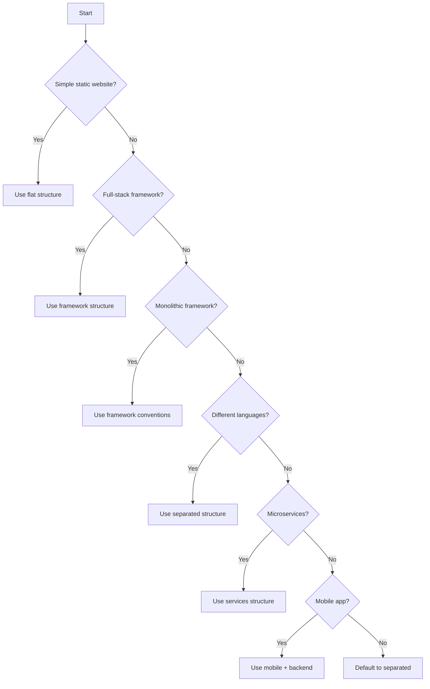

# Project Structure Decision Tree

This guide helps agents and stakeholders select the appropriate project structure based on technology choices and project requirements.

## Decision Flow



## Detailed Decision Criteria

### 1. Simple Static Website
**When to use**: HTML/CSS/JS only, no backend needed
```
project/
├── index.html
├── assets/
│   ├── css/
│   ├── js/
│   └── images/
└── README.md
```

### 2. Full-Stack Framework
**When to use**: Next.js, Nuxt.js, SvelteKit, Remix
- Framework handles both frontend and backend
- Integrated routing and API routes
- Server-side rendering capabilities

**Choose**: `fullstack-frameworks/[framework-name]`

### 3. Monolithic Framework
**When to use**: Django, Rails, Laravel with server-side rendering
- Traditional MVC architecture
- Server-rendered templates
- Integrated admin interfaces

**Choose**: `monolithic/[framework-name]`

### 4. Separated Frontend/Backend
**When to use**: Most modern web applications
- Frontend: React, Vue, Angular
- Backend: Node.js, Python, Java, Go
- API-driven architecture
- Independent deployment needs

**Choose**: `separated-stack/[frontend-backend-combo]`

### 5. Microservices
**When to use**: Large, complex systems
- Multiple independent services
- Different teams per service
- Need for independent scaling
- Service mesh requirements

**Choose**: `microservices/[architecture-type]`

### 6. Mobile + Backend
**When to use**: Mobile-first applications
- React Native or Flutter app
- Backend API service
- Optional admin web panel

**Choose**: `mobile/[mobile-backend-combo]`

## Quick Selection Guide

### By Frontend Technology

| Frontend | Backend | Template |
|----------|---------|----------|
| React | Node.js | `separated-stack/react-node` |
| React | Python | `separated-stack/react-python` |
| React | Spring Boot | Use `react-node` + customize |
| Vue | Django | `separated-stack/vue-django` |
| Vue | Node.js | Use `react-node` + swap frontend |
| Angular | Spring Boot | `separated-stack/angular-spring` |
| Next.js | Built-in | `fullstack-frameworks/nextjs` |
| Nuxt.js | Built-in | `fullstack-frameworks/nuxtjs` |

### By Backend Technology

| Backend | Frontend Options | Recommended Template |
|---------|-----------------|---------------------|
| Node.js/Express | React, Vue, Angular | `separated-stack/react-node` |
| Django | React, Vue, Templates | `separated-stack/vue-django` or `monolithic/django` |
| Rails | React, Vue, ERB | `monolithic/rails` |
| Laravel | React, Vue, Blade | `separated-stack/laravel-react` or `monolithic/laravel` |
| Spring Boot | React, Angular | `separated-stack/angular-spring` |
| FastAPI | React, Vue | `separated-stack/react-python` |

### By Project Type

| Project Type | Recommended Structure | Template |
|--------------|---------------------|----------|
| B2B SaaS | Separated | `separated-stack/react-node` |
| E-commerce | Full-stack or Separated | `fullstack-frameworks/nextjs` |
| Blog/CMS | Monolithic or Full-stack | `monolithic/django` |
| API-only | Backend only | Customize from separated |
| Mobile App | Mobile + API | `mobile/react-native-node` |
| Enterprise | Microservices | `microservices/polyglot-microservices` |

## Special Considerations

### SEO Requirements
- **High**: Use Next.js, Nuxt.js, or monolithic
- **Medium**: Any structure with SSR
- **Low**: SPA with separated structure

### Team Size
- **1-3 developers**: Monolithic or full-stack
- **4-10 developers**: Separated structure
- **10+ developers**: Consider microservices

### Deployment Complexity
- **Simple**: Monolithic, full-stack
- **Medium**: Separated structure
- **Complex**: Microservices

### Performance Requirements
- **Static content**: Full-stack with SSG
- **Dynamic content**: Separated with caching
- **Real-time**: Separated with WebSockets

## Migration Paths

### From Monolithic to Separated
1. Identify API boundaries
2. Extract frontend to separate folder
3. Create API layer in backend
4. Update deployment pipeline

### From Separated to Microservices
1. Identify service boundaries
2. Extract services one by one
3. Implement service discovery
4. Add API gateway

## Validation Questions

Before finalizing structure choice:
1. Will different teams work on frontend/backend?
2. Do you need independent deployment?
3. Are there specific framework requirements?
4. What are the SEO requirements?
5. What's the expected team size?
6. Any compliance/security requirements?

## References

- Based on industry best practices
- Validated through ComplianceCore project learnings
- Continuously updated based on community feedback