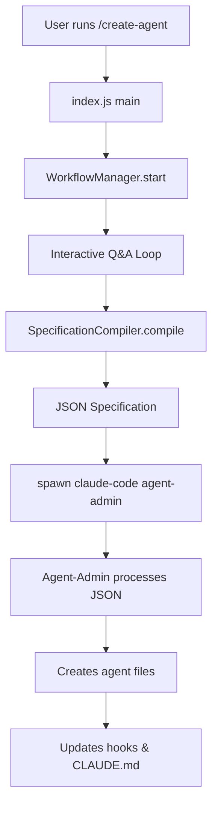
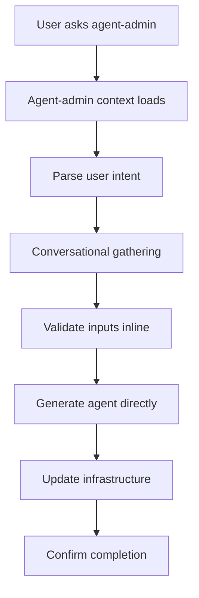

# Create-Agent System: Deletion and Modification Plan

## Current System Architecture Analysis

### 1. Current State Management Approach

The current system uses a **multi-process, external spawning architecture** with the following state management:

#### State Storage Mechanisms:
1. **WorkflowManager Class** (`.claude/scripts/commands/create-agent/workflow.js`)
   - Uses `this.userAnswers = new Map()` for in-memory state storage
   - Tracks `this.currentStep` for workflow progress (1-10 steps)
   - No persistence between sessions - all state is ephemeral
   - State is passed to compiler via constructor: `new SpecificationCompiler(this.workflow.userAnswers)`

2. **Process Communication**
   - Uses `spawn('claude-code', ['chat', '--agent', 'agent-admin', prompt])` for external process
   - Passes compiled JSON specification via command-line prompt argument
   - No bidirectional communication - fire-and-forget pattern
   - Output captured via stdout/stderr streams

3. **No Persistent State Files**
   - No state files found (searched for `*state*`, `*session*`)
   - All workflow state exists only during command execution
   - Agent creation results stored in:
     - `.claude/agents/[agent-name].md` (agent file)
     - `.claude/agents/logs/agents.json` (agent registry)
     - CLAUDE.md (documentation updates)
     - Hook files (detection patterns)

### 2. Files to DELETE (External Process System)

These files implement the external command/workflow system that will be replaced:

#### Primary Command Implementation:
```
.claude/scripts/commands/create-agent/
├── index.js           # Main entry point with spawn() logic - DELETE
├── workflow.js        # Interactive workflow manager - DELETE  
├── compiler.js        # JSON specification compiler - DELETE
├── validation.js      # Input validation utilities - MODIFY (keep validation logic)
├── README.md          # Documentation - DELETE
└── test-results.md    # Test documentation - DELETE
```

#### Command Wrappers:
```
.claude/commands/
├── create-agent.sh    # Shell wrapper for node command - DELETE
├── create-agent.md    # Command documentation - DELETE
└── delete-agent.sh    # Related deletion wrapper - KEEP (different workflow)
```

#### Lifecycle Management (if using external process):
```
.claude/scripts/
├── agent-lifecycle-manager.js  # MODIFY - remove external process logic
└── manage-agent-hooks.js       # KEEP - still needed for hook management
```

### 3. Files to MODIFY (Adapt for Conversational Flow)

#### A. Validation Module (`.claude/scripts/commands/create-agent/validation.js`)
**Current Purpose**: Validates user input during workflow
**New Purpose**: Validation utilities for agent-admin conversational flow
**Changes Needed**:
- Remove readline-specific formatting
- Convert to pure validation functions
- Export for use by agent-admin contexts

#### B. Agent Lifecycle Manager (`.claude/scripts/agent-lifecycle-manager.js`)
**Current Purpose**: Manages agent creation/deletion lifecycle
**New Purpose**: Direct agent file manipulation utilities
**Changes Needed**:
- Remove command-line argument parsing
- Remove test/example code
- Convert to pure utility functions for agent-admin
- Keep hook management integration
- Keep CLAUDE.md update logic

### 4. NEW Files to Create (Conversational System)

#### A. Agent-Admin Context Enhancement:
```
.claude/agents/agent-tools/agent-admin/
├── conversational-workflow.md     # NEW - Conversational flow patterns
├── validation-utilities.md        # NEW - Validation logic reference
└── state-management.md           # NEW - How to track workflow state in conversation
```

#### B. Shared Utilities:
```
.claude/agents/shared-tools/
└── agent-creation-utilities.md   # NEW - Shared creation utilities
```

### 5. Current External Process Flow (To Be Eliminated)



### 6. New Conversational Flow (To Be Implemented)



## Migration Strategy

### Phase 1: Delete External System
1. Remove `.claude/scripts/commands/create-agent/` directory
2. Remove `.claude/commands/create-agent.*` files
3. Clean up any references in other files

### Phase 2: Extract Reusable Logic
1. Extract validation functions from `validation.js`
2. Extract agent file generation logic from lifecycle manager
3. Extract hook update logic for reuse

### Phase 3: Implement Conversational System
1. Create new agent-admin context files
2. Implement conversational state tracking
3. Add validation and generation inline
4. Test end-to-end flow

### Phase 4: Documentation Update
1. Update CLAUDE.md to remove /create-agent references
2. Document new conversational approach
3. Update agent-admin documentation

## Key Differences: External vs Conversational

| Aspect | External Process | Conversational |
|--------|-----------------|----------------|
| **Invocation** | `/create-agent` command | Natural language to agent-admin |
| **State Storage** | In-memory Map during execution | Conversation context |
| **User Interaction** | Terminal readline prompts | Chat messages |
| **Process Model** | Spawns separate process | Single conversation thread |
| **Error Recovery** | Must restart command | Can clarify in conversation |
| **Flexibility** | Fixed 10-step workflow | Dynamic based on needs |
| **Context Awareness** | None - isolated process | Full conversation history |
| **Token Usage** | New context each spawn | Continuous context |

## Files Summary

### TO DELETE (12 files):
- `.claude/scripts/commands/create-agent/index.js`
- `.claude/scripts/commands/create-agent/workflow.js`
- `.claude/scripts/commands/create-agent/compiler.js`
- `.claude/scripts/commands/create-agent/README.md`
- `.claude/scripts/commands/create-agent/test-results.md`
- `.claude/commands/create-agent.sh`
- `.claude/commands/create-agent.md`
- Entire `.claude/scripts/commands/create-agent/` directory after extraction

### TO MODIFY (3 files):
- `.claude/scripts/commands/create-agent/validation.js` → Extract and adapt
- `.claude/scripts/agent-lifecycle-manager.js` → Remove CLI logic
- `.claude/scripts/manage-agent-hooks.js` → Ensure compatibility

### TO CREATE (4+ files):
- `.claude/agents/agent-tools/agent-admin/conversational-workflow.md`
- `.claude/agents/agent-tools/agent-admin/validation-utilities.md`
- `.claude/agents/agent-tools/agent-admin/state-management.md`
- `.claude/agents/shared-tools/agent-creation-utilities.md`

## State Management Analysis

The current system has **no persistent state management** - it relies entirely on:
1. **Ephemeral in-memory state** during command execution
2. **Final output files** as the only persistent artifacts
3. **No session recovery** - if process fails, must restart
4. **No state sharing** between processes

The new conversational system will leverage:
1. **Claude's conversation context** as state storage
2. **Progressive refinement** through conversation
3. **Natural error recovery** via clarification
4. **Context-aware decisions** based on conversation history

---

**AgileBiz™** - Created by Phillip Darren Brown (https://github.com/DiscDev)